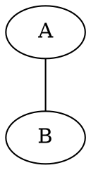
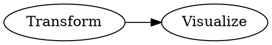

## [1] 1
```

Listing 1: Assignment in R

Listing 1

If you need to reference both the code its output, use a combination of a display block and a code block with the code cell option `echo: false`:

````markdown
::: {#lst-assign-both}
```r
x <- 1
x
```

```{r}
#| echo: false
x <- 1
x
```

Assignment in R
:::
````

When the output is a figure or table, you can reference the code and the output individually by using code cell options, rather than the div syntax, as described in [Cross-References for Executable Code Blocks](https://quarto.org/docs/authoring/cross-references.html#computations-1).

### Diagrams

To create a cross-references to a diagram using div syntax, treat it like a figure. For example, Figure 3 is created using:

```markdown
::: {#fig-simple}
```{dot}
graph {
 A -- B
}
```

This is a simple graphviz graph
:::
```

Result:



Figure 3: This is a simple graphviz graph

If you would rather give diagrams a label and counter distinct from figures, consider defining [Custom Cross-Reference Types](https://quarto.org/docs/authoring/cross-references-custom.html).

### Videos

To add a cross-reference to a video, use the [cross-reference div syntax](#overview) and treat it like a figure. For example,

```markdown
::: {#fig-cern}


The video "CERN: The Journey of Discovery"
:::

In @fig-cern...
```

Which renders as:

> [Video: CERN: The Journey of Discovery](https://www.youtube.com/embed/wo9vZccmqwc)
>
> Figure 4: The video "CERN: The Journey of Discovery"
>
> In Figure 4...

If you would rather give videos a label and counter distinct from figures, consider defining [Custom Cross-Reference Types](https://quarto.org/docs/authoring/cross-references-custom.html).

### Subreferences

**Note:** When your sub-content is either all figures or all tables there is abbreviated syntax, see the Cross References page for [Subfigures](https://quarto.org/docs/authoring/cross-references.html#subfigures) and [Subtables](https://quarto.org/docs/authoring/cross-references.html#subtables) for details.

Cross-reference divs can be nested to create elements with subreferences. For example, the outer div here defines the `fig-subrefs` reference along with the main caption, while the inner divs define `fig-first` and `fig-second` along with their respective captions:

```markdown
:::: {#fig-subrefs}
::: {#fig-first}
CONTENT 1
First caption
:::

::: {#fig-second}
CONTENT 2
Second caption
:::

Main caption
::::
```

This renders as:

> CONTENT 1
>
> (a) First caption
>
> CONTENT 2
>
> (b) Second caption
>
> Figure 5: Main caption

Both the main element and the sub elements can be referenced directly in the text, e.g. `@fig-subrefs, @fig-first, @fig-second`

This renders as: Figure 5, Figure 5 (a), Figure 5 (b).

Combined with layout attributes, you can create complex layouts of mixed content where each element can be referenced. For example:

````markdown
:::: {#fig-complex layout="[ [ 1, 1 ] , [ 1 ] ]"}
::: {#fig-elephant}

An image file
:::

::: {#fig-scatterplot}
```{r}
#| echo: false
plot(1:10)
```
A computational figure
:::

::: {#fig-diagram}
```{dot}
//| fig-height: 2
digraph {
 rankdir="LR";
 Transform -> Visualize
}
```
A diagram
:::

Example figure combining different types of content
::::
````

This renders as:


(a) An image file

{width="672"}
(b) A computational figure


(c) A diagram

Figure 6: Example figure combining different types of content

### Computed Captions

If you want to include computed values in a caption, use the cross-reference div syntax, along with an [inline code expression](https://quarto.org/docs/computations/inline-code.html). For example:

**Python:**

````markdown
::: {#fig-box}
```{python}
#| echo: false
import matplotlib.pyplot as plt
x = [1, 2, 3, 4, 5, 10]
p = plt.boxplot(x)
plt.show()
```

This dataset has `{python} len(x)` observations.
:::
````

**R:**

````markdown
::: {#fig-box}
```{r}
#| echo: false
x <- c(1, 2, 3, 4, 5, 10)
boxplot(x)
```

This dataset has `{r} length(x)` observations.
:::
````

### Conditional Content

The cross-reference div syntax combined with [conditional content](https://quarto.org/docs/authoring/conditional.html) allows the content of your reference to vary by format. For example, you might want an interactive JavaScript based plot when the format is HTML, but otherwise produce a static plot:

````markdown
::: {#fig-scatterplot}

:::: {.content-visible when-format="html"}
```{r}
# Code to produce JavaScript based plot
```
::::

:::: {.content-visible unless-format="html"}
```{r}
# Code to produce static plot
```
::::

Scatterplot
:::

@fig-scatterplot
````

