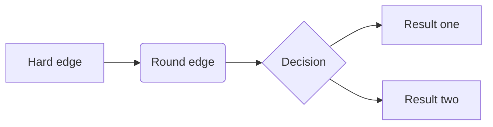
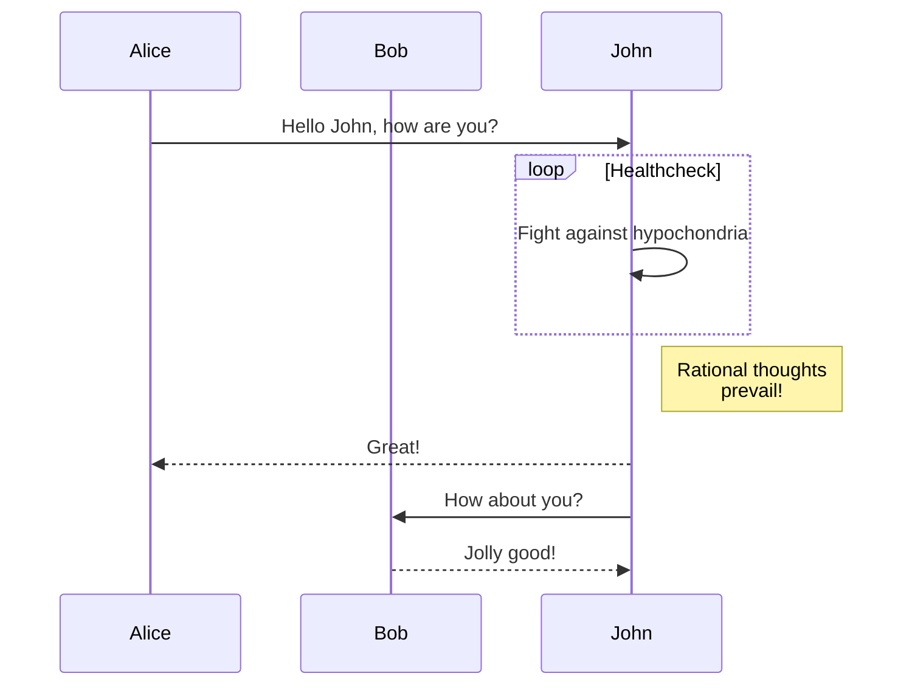
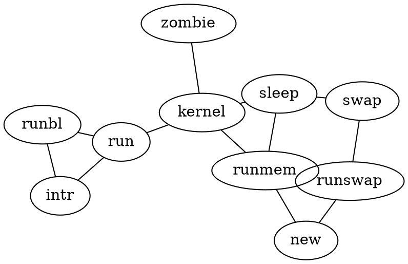
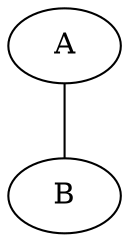
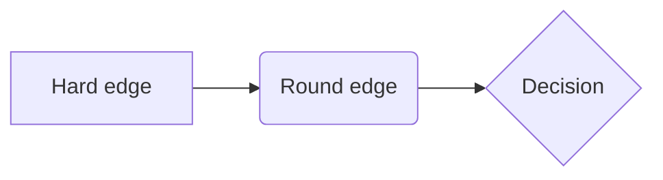

## Authoring Diagrams

Source: [Diagrams – Quarto](https://quarto.org/docs/authoring/diagrams.html)

### Overview

Quarto has native support for embedding [Mermaid](https://quarto.org/docs/authoring/diagrams.html#mermaid) and [Graphviz](https://quarto.org/docs/authoring/diagrams.html#graphviz) diagrams. This enables you to create flowcharts, sequence diagrams, state diagrams, gantt charts, and more using a plain text syntax inspired by markdown.

For example, here we embed a flowchart created using Mermaid:

````markdown
```{mermaid}
flowchart LR
  A[Hard edge] --> B(Round edge)
  B --> C{Decision}
  C --> D[Result one]
  C --> E[Result two]
```
````

Result:



As illustrated above, Mermaid diagrams are embedded using `{mermaid}` executable cells. Graphviz diagrams are embedded using `{dot}` executable cells. Note that cell options are added with slightly different syntax: `%%|` for `{mermaid}`, and `//|` for `{dot}`.

**Note:** For print output formats like `pdf` or `docx`, diagram rendering makes use of the Chrome or Edge web browser to create a high-quality PNG. Quarto can automatically use an existing version of Chrome or Edge on your system, or alternatively if you don’t have either installed, can use a lighter-weight library version of Chrome (see [Chrome Install](#chrome-install) below for details).

### Mermaid

[Mermaid](https://mermaid.js.org/) is a Javascript based diagramming and charting tool that uses Markdown-inspired text definitions and a renderer to create and modify complex diagrams.

Mermaid diagrams use `%%` as their comment syntax, and so cell options are declared using `%%|`. Cell options *must* be included directly beneath the start of the diagram code chunk.

Above we demonstrated a flowchart created with Mermaid, here is a sequence diagram (also embedded using a `{mermaid}` executable cell):

````markdown
```{mermaid}
sequenceDiagram
  participant Alice
  participant Bob
  Alice->>John: Hello John, how are you?
  loop Healthcheck
    John->>John: Fight against hypochondria
  end
  Note right of John: Rational thoughts <br/>prevail!
  John-->>Alice: Great!
  John->>Bob: How about you?
  Bob-->>John: Jolly good!
```
````

Result:



Note that Mermaid output varies depending on the target format (e.g. HTML vs. print-based). See the section below on [Mermaid Formats](#mermaid-formats) for additional details.

To learn more about using Mermaid, see the [Mermaid website](https://mermaid.js.org/) or the [Mermaid book](https://mermaid-js.github.io/mermaid/) (which is written by the creator of Mermaid).

### Graphviz

The [Graphviz](https://graphviz.org/) layout programs take descriptions of graphs in a simple text language, and make diagrams in useful formats. Graphviz has many useful features for concrete diagrams, such as options for colors, fonts, tabular node layouts, line styles, hyperlinks, and custom shapes.

Graphviz diagrams use `//` as their comment syntax, and so cell options are declared using `//|`. Cell options *must* be included directly beneath the start of the diagram code chunk.

For example, here is a simple undirected graph created using graphviz:

````markdown
```{dot}
graph G {
  layout=neato
  run -- intr;
  intr -- runbl;
  runbl -- run;
  run -- kernel;
  kernel -- zombie;
  kernel -- sleep;
  kernel -- runmem;
  sleep -- swap;
  swap -- runswap;
  runswap -- new;
  runswap -- runmem;
  new -- runmem;
  sleep -- runmem;
}
```
````

Result:



To learn more about Graphviz, see the [Graphviz website](https://graphviz.org/), this list of simple [Graphiz Examples](https://www.graphviz.org/doc/info/examples.html), or the [Graphviz Gallery](https://graphviz.org/gallery/).

### Authoring

There are a variety of tools available to improve your productivity authoring diagrams:

*   The [Mermaid Live Editor](https://mermaid.live/) is an online tool for editing and previewing Mermaid diagrams in real time.
*   [Graphviz Online](https://dreampuf.github.io/GraphvizOnline/) provides a similar tool for editing Graphviz diagrams.
*   [RStudio](https://posit.co/products/open-source/rstudio/) includes support for editing and previewing `.mmd` and `.dot` files (with help from the [DiagrammeR](https://rich-iannone.github.io/DiagrammeR/) package).
*   The Quarto [VS Code Extension](https://marketplace.visualstudio.com/items?itemName=quarto.quarto) supports live preview of diagrams embedded in `.qmd` files and in `.mmd` and `.dot` files:


Note that you should be sure to have installed the *very latest* version of the Quarto VS Code extension to try this out.

### Cross-References

Diagrams can be treated as figures the same way that images and plot output are. For example, if we added the following figure options to the diagram above:

````markdown
```{dot}
//| label: fig-simple
//| fig-cap: "This is a simple graphviz graph."
```
````

We’d get this output:


Figure 1: This is a simple graphviz graph.

We could then create a cross-reference to the diagram with:

```markdown
@fig-simple
```

To create a cross-references to a diagram using div syntax, treat it like a figure. For example, Figure 2 is created using:

```markdown
::: {#fig-simple-div}
```{dot}
graph {
 A -- B
}
```

This is a simple graphviz graph
:::
```

Result:



Figure 2: This is a simple graphviz graph

If you would rather give diagrams a label and counter distinct from figures, consider defining [Custom Cross-Reference Types](https://quarto.org/docs/authoring/cross-references-custom.html).

### File Include

You might find it more convenient to edit your diagram in a standalone `.dot` or `.mmd` file and then reference it from within your `.qmd` document. You can do this by adding the `file` option to a Mermaid or Graphviz cell.

For example, here we include a very complex diagram whose definition would be too unwieldy to provide inline:

````markdown
```{dot}
//| label: fig-linux-kernel
//| fig-cap: "A diagram of the Linux kernel."
//| file: linux-kernel-diagram.dot
```
````

Result:

```dot
//| label: fig-linux-kernel
//| fig-cap: "A diagram of the Linux kernel."
//| file: linux-kernel-diagram.dot
```

Figure 3: A diagram of the Linux kernel.

Note that the `label` and `fig-cap` attributes still work as expected with `file` includes.

### Sizing

By default, diagrams are rendered at their natural size (i.e. they are not stretched to fit the default figure size for the current document). Within HTML output formats, diagrams are also made responsive, so that their width doesn’t overflow the current page column. This is similar to the treatment given to images and dynamic JavaScript widgets.

You can disable responsive sizing by specifying the `fig-responsive: false` option. You can also specify explicit sizes via `fig-width` and `fig-height`. For example, here we want to make a mermaid diagram a bit bigger because it contains only a few elements:

````markdown
```{mermaid}
%%| fig-width: 6.5
flowchart LR
  A[Hard edge] --> B(Round edge)
  B --> C{Decision}
```
````

Result:



### Mermaid Formats

When you include a Mermaid diagram in a document, the diagram format used is chosen automatically based on the output format:

| Format                         | Output                 |
| :----------------------------- | :--------------------- |
| HTML (`html`, `revealjs`, etc.)| Mermaid native (JavaScript) |
| GitHub Flavored Markdown (`gfm`)| Mermaid code block     |
| Other Formats (`pdf`, `docx`, etc.)| PNG image              |

The Mermaid native format is used by default whenever the underlying output format supports JavaScript.

When using `format: gfm`, diagrams will be emitted as plain `mermaid` code blocks. This is because both [GitHub](https://github.blog/2022-02-14-include-diagrams-markdown-files-mermaid/) and [GitLab](https://docs.gitlab.com/ee/user/markdown.html#mermaid) natively support rendering Mermaid diagrams from code.

For formats that don’t do special handling of Mermaid or lack a JavaScript run-time (e.g. formats like `pdf`, `docx`, `epub`, etc.) a PNG image is created using [Chrome](#chrome-install).

You can change the default behavior using the `mermaid-format` option. For example:

```yaml
---
format:
  gfm:
    mermaid-format: png
---
```

Valid values for `mermaid-format` include `js`, `png`, and `svg`.

### Mermaid Themes

The following sections describe the ways in which you can control the color theme of Mermaid diagrams:

*   Using the current document theme.
*   Using one of Mermaid’s own color themes via a YAML option.
*   Using SCSS and CSS variables.

#### Default Colors for Mermaid Diagrams

If you use Quarto’s [bootswatch built-in themes](https://quarto.org/docs/output-formats/html-themes.html), including the default theme, or a custom theme that uses the same SCSS variables, your Mermaid diagrams will automatically follow your theme.

The following examples demonstrate this with a few of Quarto’s built-in bootswatch themes.

*   **Darkly** 
*   **Sandstone** 
*   **Vapor** 

You can read more about the correspondence between Bootstrap’s SCSS variables and Quarto’s Mermaid SCSS variables, and how to change it, below in [Customizing the Mermaid Theme](#customizing-the-mermaid-theme).

#### Using Mermaid’s Built-in Themes

If you want to use Mermaid’s own themes, you can do so by configuring the `mermaid` option in your YAML front matter:

```yaml
format:
  html:
    mermaid:
      theme: forest
```

The available themes from mermaid are: `default`, `dark`, `forest`, and `neutral`.

*   **default** 
*   **dark** 
*   **forest** 
*   **neutral** 

#### Customizing the Mermaid Theme

Quarto provides its own Mermaid SCSS and CSS variables that can be overwritten to allow some customization of the diagram theme. The SCSS variables, together with their default values, are:

```scss
$mermaid-bg-color: $body-bg;
$mermaid-edge-color: $secondary;
$mermaid-node-fg-color: $body-color;
$mermaid-fg-color: $body-color;
$mermaid-fg-color--lighter: lighten($body-color, 10%);
$mermaid-fg-color--lightest: lighten($body-color, 20%);
$mermaid-font-family: $font-family-sans-serif;
$mermaid-label-bg-color: $body-bg;
$mermaid-label-fg-color: $primary;
$mermaid-node-bg-color: rgba($primary, 0.1);
$mermaid-node-fg-color: $primary;
```

Their CSS variable counterparts are:

```css
:root {
  --mermaid-bg-color: #{$mermaid-bg-color};
  --mermaid-edge-color: #{$mermaid-edge-color};
  --mermaid-node-fg-color: #{$mermaid-node-fg-color};
  --mermaid-fg-color: #{$mermaid-fg-color};
  --mermaid-fg-color--lighter: #{$mermaid-fg-color--lighter};
  --mermaid-fg-color--lightest: #{$mermaid-fg-color--lightest};
  --mermaid-font-family: #{$mermaid-font-family};
  --mermaid-label-bg-color: #{$mermaid-label-bg-color};
  --mermaid-label-fg-color: #{$mermaid-label-fg-color};
  --mermaid-node-bg-color: #{$mermaid-node-bg-color};
  --mermaid-node-fg-color: #{$mermaid-node-fg-color};
}
```

For example, to provide a custom color for the background of the nodes you could [add a custom CSS stylesheet](https://quarto.org/docs/output-formats/html-basics.html#css-styles) containing:

```css
:root {
  --mermaid-node-bg-color: #375a7f;
}
```

You can find the correspondence between Quarto’s variables and Mermaid’s native CSS classes in Quarto’s source code in the file [`embed-mermaid.css`](https://github.com/quarto-dev/quarto-cli/blob/main/src/resources/formats/html/pandoc/embed-mermaid.css).

### Code Echo

Note that unlike other executable cell handlers (e.g. `{python}`), cells with diagrams don’t display their code in the rendered document by default. You can display code by adding an `echo: true` option in a comment at the top the cell.

To include code for `{mermaid}`, add `%%| echo: true` to the top of the cell. For example:

````markdown
```{mermaid}
%%| echo: true
```
````

To include code for `{dot}`, add `//| echo: true` to the top of the cell. For example:

````markdown
```{dot}
//| echo: true
```
````

### Chrome Install

For printing to output formats like `pdf` or `docx`, diagram rendering makes use of the Chrome or Edge web browser to create a high-quality PNG.

Quarto can automatically use an existing version of Chrome or Edge on your system for rendering. Alternatively, if you don’t have either, you can install a minimal version of Chrome for use by Quarto with the following command:

```bash
quarto install chromium
```

**Note:** Quarto installs headless Chromium via Puppeteer. The bundled Chromium that Puppeteer installs may not work on Docker containers; please check [the Puppeteer documentation](https://pptr.dev/troubleshooting#running-puppeteer-on-wsl-windows-subsystem-for-linux) as well as [this article](https://github.com/puppeteer/puppeteer/blob/main/docs/troubleshooting.md#running-puppeteer-in-docker) if you are attempting to install within Windows Subsystem for Linux (WSL).

