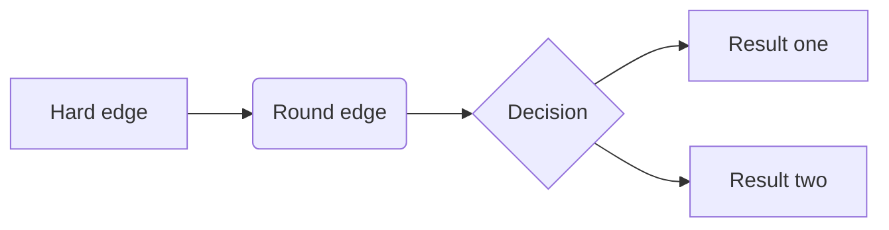

## Authoring Markdown Basics

Source: [Markdown Basics – Quarto](https://quarto.org/docs/authoring/markdown-basics.html)

### Overview

Quarto is based on Pandoc and uses its variation of markdown as its underlying document syntax. Pandoc markdown is an extended and slightly revised version of John Gruber’s [Markdown](https://daringfireball.net/projects/markdown/) syntax.

Markdown is a plain text format that is designed to be easy to write, and, even more importantly, easy to read:

> A Markdown-formatted document should be publishable as-is, as plain text, without looking like it’s been marked up with tags or formatting instructions. – [John Gruber](https://daringfireball.net/projects/markdown/syntax#philosophy)

This document provides examples of the most commonly used markdown syntax. See the full documentation of [Pandoc’s Markdown](https://pandoc.org/MANUAL.html#pandocs-markdown) for more in-depth documentation.

### Text Formatting

| Markdown Syntax                 | Output               |
| :------------------------------ | :------------------- |
| `*italics*, **bold**, ***bold italics***` | *italics*, **bold**, ***bold italics*** |
| `superscript^
```markdown
| Markdown Syntax                 | Output               |
| :------------------------------ | :------------------- |
| `*italics*, **bold**, ***bold italics***` | *italics*, **bold**, ***bold italics*** |
| `superscript^2^ / subscript~2~` | superscript^2^ / subscript~2~ |
| `~~strikethrough~~`             | ~~strikethrough~~     |
| `` `verbatim code` ``           | `verbatim code`      |

### Headings

| Markdown Syntax | Output      |
| :-------------- | :---------- |
| `# Heading 1`   | ## Heading 1 |
| `## Heading 2`  | ### Heading 2 |
| `### Heading 3` | #### Heading 3 |
| `#### Heading 4`| ##### Heading 4 |
| `##### Heading 5`| ###### Heading 5 |
| `###### Heading 6`| ####### Heading 6 |

### Links & Images

| Markdown Syntax                               | Output                                      |
| :-------------------------------------------- | :------------------------------------------ |
| `<https://quarto.org>`                        | <https://quarto.org>                        |
| `[Quarto](https://quarto.org)`                | [Quarto](https://quarto.org)                |
| ``                    |                     |
| `[](https://quarto.org)` | [](https://quarto.org) |
| `[](https://quarto.org)` | [](https://quarto.org) |
| `[{fig-alt="Alt text"}](https://quarto.org)` | [{fig-alt="Alt text"}](https://quarto.org) |

### Lists

| Markdown Syntax                                 | Output                                    |
| :---------------------------------------------- | :---------------------------------------- |
| `* unordered list`<br>`    + sub-item 1`<br>`    + sub-item 2`<br>`        - sub-sub-item 1` | *   unordered list<br>    *   sub-item 1<br>    *   sub-item 2<br>        *   sub-sub-item 1 |
| `*   item 2`<br>`    Continued (indent 4 spaces)` | *   item 2<br>    Continued (indent 4 spaces) |
| `1. ordered list`<br>`2. item 2`<br>`    i) sub-item 1`<br>`         A.  sub-sub-item 1` | 1.  ordered list<br>2.  item 2<br>    i)  sub-item 1<br>        A.  sub-sub-item 1 |
| `- [ ] Task 1`<br>`- [x] Task 2`                | *   [ ] Task 1<br>*   [x] Task 2           |
| `(@)  A list whose numbering`<br>`continues after`<br>`(@)  an interruption` | (@) A list whose numbering<br>continues after<br>(@) an interruption |
| `::: {}`<br>`1. A list`<br>`:::`<br><br>`::: {}`<br>`1. Followed by another list`<br>`:::` | ::: {#list-break-example-1 .unlisted}<br>1.  A list<br>:::<br><br>::: {#list-break-example-2 .unlisted}<br>1.  Followed by another list<br>::: |
| `term`<br>`: definition`                        | term<br>:   definition                    |

Note that unlike other Markdown renderers (notably Jupyter and GitHub), lists in Quarto require an entire blank line above the list. Otherwise the list will not be rendered in list form, rather it will all appear as normal text along a single line.

### Footnotes

Pandoc supports numbering and formatting footnotes using the following syntax:

```markdown
Here is a footnote reference,[^1] and another.[^longnote]

[^1]: Here is the footnote.

[^longnote]: Here's one with multiple blocks.

    Subsequent paragraphs are indented to show that they
belong to the previous footnote.

        { some.code }

    The whole paragraph can be indented, or just the first
    line.  In this way, multi-paragraph footnotes work like
    multi-paragraph list items.

This paragraph won't be part of the note, because it
isn't indented.
```

The above syntax generates the following output:

> Here is a footnote reference,^[[Here is the footnote.](https://quarto.org/docs/authoring/markdown-basics.html#fn1)] and another.^[[Here's one with multiple blocks. Subsequent paragraphs are indented to show that they belong to the previous footnote. `{ some.code }` The whole paragraph can be indented, or just the first line. In this way, multi-paragraph footnotes work like multi-paragraph list items.](https://quarto.org/docs/authoring/markdown-basics.html#fn2)]
>
> This paragraph won’t be part of the note, because it isn’t indented.

In addition, you can also write single paragraph footnotes inline using the following syntax:

```markdown
Here is an inline note.^[Inlines notes are easier to write,
since you don't have to pick an identifier and move down to
type the note.]
```

This syntax generates the following output:

> Here is an inline note.^[[Inlines notes are easier to write, since you don't have to pick an identifier and move down to type the note.](https://quarto.org/docs/authoring/markdown-basics.html#fn3)]

**Footnote IDs should be unique:** Footnote identifiers, e.g., the `1` in `^1`, need to be unique within a document. In Quarto books, chapters are combined into a single document for certain formats (including PDF, DOCX, and EPUB), so footnote identifiers need to be unique *across* chapters.

The footnotes that are generated from the above examples are included in the [Example Footnotes](#example-footnotes) section at the bottom of the page. See the [Pandoc Footnotes](https://pandoc.org/MANUAL.html#footnotes) for additional information.

### Tables

| Markdown Syntax                                  | Output         |
| :----------------------------------------------- | :------------- |
| `| Right | Left  | Default | Center |`<br>`|------:|:------|---------|:------:|`<br>`|   12  |  12   |    12   |    12  |`<br>`|  123  |  123  |   123   |   123  |`<br>`|    1  |    1  |     1   |     1  |` | Right \| Left \| Default \| Center \|<br>\|------:\|:------\|---------\|:------:\|<br>\| 12 \| 12 \| 12 \| 12 \|<br>\| 123 \| 123 \| 123 \| 123 \|<br>\| 1 \| 1 \| 1 \| 1 \| |

Learn more in the article on [Tables](https://quarto.org/docs/authoring/tables.html).

### Source Code

Use ````` to delimit blocks of source code:

````markdown
```
code
```
````

Add a language to syntax highlight code blocks:

````markdown
```python
1 + 1
```
````

Pandoc supports syntax highlighting for over [140 different languages](https://pandoc.org/MANUAL.html#option--list-highlight-languages). If your language is not supported then you can use the `default` language to get a similar visual treatment:

````markdown
```default
code
```
````

Equivalent to the short form used in the examples above is a longer form that uses the language as a class (i.e. `.python`) inside braces:

````markdown
```{.python}
1 + 1
```
````

The longer form allows you to add attributes to the block in a similar way to [Divs](#divs-and-spans). Some specific features that use this syntax are [Lines Numbers](https://quarto.org/docs/output-formats/html-code.html#line-numbers) and [Code Filename](https://quarto.org/docs/output-formats/html-code.html#code-filename). Here is an example of the latter:

````markdown
```{.python filename="run.py"}
code
```
````

If you are creating HTML output there is a wide variety of options available for code block output. See the article on [HTML Code](https://quarto.org/docs/output-formats/html-code.html) for additional details.

### Raw Content

Raw content can be included directly without Quarto parsing it using [Pandoc’s raw attribute](https://pandoc.org/MANUAL.html#generic-raw-attribute). A raw block starts with ```{=`` followed by a format and closing `}`, e.g. here’s a raw HTML block:

````markdown
```{=html}
<iframe src="https://quarto.org/" width="500" height="400"></iframe>
```
````

For PDF output use a raw LaTeX block:

````markdown
```{=latex}
\renewcommand*{\labelitemi}{\textgreater}
```
````

As another example, if you are using the [Typst format](https://quarto.org/docs/output-formats/typst.html) you can use a raw block to include Typst syntax:

````markdown
```{=typst}
#set text(fill: red)
This text is red.
```
````

You can also include raw content inline:

```markdown
Here's some raw inline HTML: `<a>html</a>`{=html}
```

### Equations

Use `$` delimiters for inline math and `$$` delimiters for display math. For example:

| Markdown Syntax         | Output              |
| :---------------------- | :------------------ |
| inline math: `$E = mc^{2}$` | inline math: \(E=mc^{2}\) |
| display math: `$$E = mc^{2}$$` | display math: \[E = mc^{2}\] |

If you want to define custom TeX macros, include them within `$$` delimiters enclosed in a `.hidden` block. For example:

```markdown
::: {.hidden}
$$
\def\RR{{\bf R}}
\def\bold#1{{\bf #1}}
$$
:::
```

For HTML math processed using [MathJax](https://www.mathjax.org/) (the default) you can use the `\def`, `\newcommand`, `\renewcommand`, `\newenvironment`, `\renewenvironment`, and `\let` commands to create your own macros and environments.

### Diagrams

Quarto has native support for embedding [Mermaid](https://mermaid.js.org/) and [Graphviz](https://graphviz.org/) diagrams. This enables you to create flowcharts, sequence diagrams, state diagrams, Gantt charts, and more using a plain text syntax inspired by markdown.

For example, here we embed a flowchart created using Mermaid:

````markdown
```{mermaid}
flowchart LR
  A[Hard edge] --> B(Round edge)
  B --> C{Decision}
  C --> D[Result one]
  C --> E[Result two]
```
````

Result:



Learn more in the article on [Diagrams](https://quarto.org/docs/authoring/diagrams.html).

### Videos

You can include videos in documents using the [`` shortcode](https://quarto.org/docs/authoring/shortcodes.html). For example, here we embed a YouTube video:

```markdown

```

Videos can refer to video files (e.g. MPEG) or can be links to videos published on YouTube, Vimeo, or Brightcove. Learn more in the article on [Videos](https://quarto.org/docs/authoring/videos.html).

### Page Breaks

The [`pagebreak` shortcode](https://quarto.org/docs/authoring/shortcodes.html) enables you to insert a native pagebreak into a document (.e.g in LaTeX this would be a `\newpage`, in MS Word a docx-native pagebreak, in HTML a `page-break-after: always` CSS directive, etc.):

```markdown
page 1

page 2
```

Native pagebreaks are supported for HTML, LaTeX, Context, MS Word, Open Document, and ePub (for other formats a form-feed character `\f` is inserted).

### Divs and Spans

You can add classes, attributes, and other identifiers to regions of content using Divs and Spans. Although the terms *Div* and *Span* originate in HTML, the syntax is used in Quarto across output formats. For example, [Callout Blocks](https://quarto.org/docs/authoring/callouts.html) are specified using the div syntax, and [Small Caps](#other-spans) are specified using the span syntax, and both work for many formats beyond HTML. You may also use CSS and/or a [Filter](https://quarto.org/docs/extensions/filters.html) along with Divs and Spans to provide styling or other behavior within rendered documents beyond what Quarto provides.

#### Divs

For example, here we add the “border” class to a region of content using a div (`:::`):

```markdown
::: {.border}
This content can be styled with a border
:::
```

Once rendered to HTML, Quarto will translate the markdown into:

```html
<div class="border">
<p>This content can be styled with a border</p>
</div>
```

Divs start with a fence containing at least three consecutive colons plus some attributes. The attributes may optionally be followed by another string of consecutive colons. The Div ends with another line containing a string of at least three consecutive colons. The Div should be separated by blank lines from preceding and following blocks. Divs may also be nested. For example

```markdown
::::: {#special .sidebar}
::: {.warning}
Here is a warning.
:::

More content.
:::::
```

Once rendered to HTML, Quarto will translate the markdown into:

```html
<div id="special" class="sidebar">
<div class="warning">
<p>Here is a warning.</p>
</div>
<p>More content.</p>
</div>
```

Fences without attributes are always closing fences. Unlike with fenced code blocks, the number of colons in the closing fence need not match the number in the opening fence. However, it can be helpful for visual clarity to use fences of different lengths to distinguish nested divs from their parents.

#### Spans

A bracketed sequence of inlines, as one would use to begin a link, will be treated as a *Span* with attributes if it is followed immediately by attributes:

```markdown
[This is *some text*]{.class key="val"}
```

Once rendered to HTML, Quarto will translate the markdown into:

```html
<span class="class" data-key="val">
  This is <em>some text</em>
</span>
```

#### Ordering of Attributes

Both divs and spans in Pandoc can have any combination of identifiers, classes, and (potentially many) key-value attributes. In order for these to be recognized by Pandoc, they have to be provided in a specific order: identifiers, classes, and then key-value attributes. Any of these can be omitted, but must follow that order if they are provided. For example, the following is valid:

```markdown
[This is good]{#id .class key1="val1" key2="val2"}
```

However, the following *will not be recognized by Pandoc*:

```markdown
[This does *not* work!]{.class key="val" #id}
```

This ordering restriction applies to both divs and spans. See Pandoc’s documentation on [Divs and Spans](https://pandoc.org/MANUAL.html#divs-and-spans) for additional details.

### Callout Blocks

| Markdown Syntax                                    | Output                                    |
| :------------------------------------------------- | :---------------------------------------- |
| `:::{.callout-note}`<br>`Note that there are five types of callouts, including:`<br>`` `note` ``, `` `tip` ``, `` `warning` ``, `` `caution` ``, and `` `important` ``.<br>`:::` | ::: {.callout-note} Note that there are five types of callouts, including: `note`, `tip`, `warning`, `caution`, and `important`. ::: |

Learn more in the article on [Callout Blocks](https://quarto.org/docs/authoring/callouts.html).

### Other Blocks

| Markdown Syntax                                            | Output                                     |
| :--------------------------------------------------------- | :----------------------------------------- |
| `> Blockquote`                                             | > Blockquote                               |
| `::: {.classname}`<br>`Div`<br>`:::`                          | Div                                        |
| `| Line Block`<br>`|   Spaces and newlines`<br>`|   are preserved` | \| Line Block<br>\|   Spaces and newlines<br>\|   are preserved |

### Other Spans

To create text in small caps, that is underlined, or that is highlighted, use a span with one of the classes `.smallcaps`, `.underline` or `.mark` respectively.

| Markdown Syntax                       | Output                    |
| :------------------------------------ | :------------------------ |
| `[This text is smallcaps]{.smallcaps}` | [This text is smallcaps]{.smallcaps} |
| `[This text is underlined]{.underline}` | [This text is underlined]{.underline} |
| `[This text is highlighted]{.mark}`   | [This text is highlighted]{.mark}   |

**In supported formats only:** Support for these classes comes directly from Pandoc. Not all formats support all of these classes. In particular, `.mark` is not currently supported in `format: pptx`.

### Special Characters

| Markdown Syntax | Output   |
| :-------------- | :------- |
| endash: `--`    | endash: – |
| emdash: `---`   | emdash: — |

### Keyboard Shortcuts

The [`kbd` shortcode](https://quarto.org/docs/authoring/shortcodes.html) can be used to describe keyboard shortcuts in documentation. On Javascript formats, it will attempt to detect the operating system of the format and show the correct shortcut. On print formats, it will print the keyboard shortcut information for all operating systems.

For example, writing the following markdown:

```markdown
To print, press . To open an existing new project, press .
```

will render the keyboard shortcuts as:

> To print, press <kbd>Shift-Ctrl-P</kbd>. To open an existing new project, press <kbd class="macos-active">Shift-Command-O</kbd><kbd class="windows-active">Shift-Control-O</kbd><kbd class="linux-active">Shift-Ctrl-L</kbd>.

### Example Footnotes

1.  Here is the footnote. [↩︎](https://quarto.org/docs/authoring/markdown-basics.html#fnref1)

2.  Here's one with multiple blocks.

    Subsequent paragraphs are indented to show that they belong to the previous footnote.

        { some.code }

    The whole paragraph can be indented, or just the first line. In this way, multi-paragraph footnotes work like multi-paragraph list items. [↩︎](https://quarto.org/docs/authoring/markdown-basics.html#fnref2)

3.  Inlines notes are easier to write, since you don't have to pick an identifier and move down to type the note. [↩︎](https://quarto.org/docs/authoring/markdown-basics.html#fnref3)

