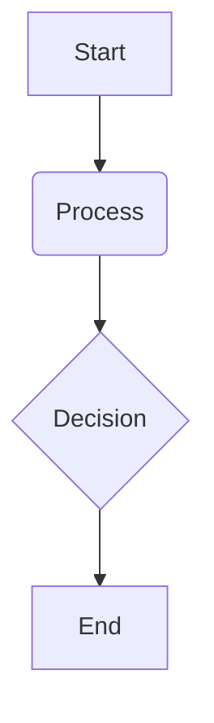
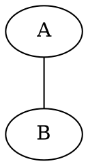

Okay, I will process the provided `quarto_documentation.txt` file, reorganize its content into a more logical structure, remove redundant or less generally useful parts (like specific blog post examples, detailed older changelogs, download instructions), and retain the core documentation for Quarto's features. The output will be a single, comprehensive Markdown file.

```markdown
# Quarto Documentation (Revised)

**Source:** Generated and revised from scraped Quarto documentation content.

**Note:** This document aims to consolidate the core concepts and features of Quarto based on the provided source text. For the absolute latest details, specific examples, and advanced edge cases, always refer to the official Quarto website (quarto.org).

## Table of Contents

*   [Introduction](#introduction)
    *   [What is Quarto?](#what-is-quarto)
    *   [Quarto vs. R Markdown](#quarto-vs-r-markdown)
*   [Getting Started](#getting-started)
    *   [Installation](#installation)
    *   [Basic Workflow](#basic-workflow)
*   [Authoring Content](#authoring-content)
    *   [Markdown Basics](#markdown-basics)
    *   [Text Formatting](#text-formatting)
    *   [Headings](#headings)
    *   [Links & Images](#links--images)
    *   [Lists](#lists)
    *   [Footnotes](#footnotes)
    *   [Tables](#tables)
    *   [Source Code Blocks](#source-code-blocks)
    *   [Raw Content](#raw-content)
    *   [Equations](#equations)
    *   [Diagrams (Mermaid & Graphviz)](#diagrams-mermaid--graphviz)
    *   [Videos](#videos)
    *   [Page Breaks](#page-breaks)
    *   [Divs and Spans](#divs-and-spans)
    *   [Callout Blocks](#callout-blocks)
    *   [Special Characters](#special-characters)
    *   [Keyboard Shortcuts (`kbd`)](#keyboard-shortcuts-kbd)
    *   [Placeholder Content (`lipsum`, `placeholder`)](#placeholder-content-lipsum-placeholder)
    *   [Rearranging Content (`contents`)](#rearranging-content-contents)
    *   [Figures](#figures)
    *   [Citations](#citations)
    *   [Cross-References](#cross-references)
    *   [Article Layout](#article-layout)
    *   [Appendices](#appendices)
    *   [Creating Citeable Articles](#creating-citeable-articles)
    *   [Title Blocks](#title-blocks)
*   [Computations](#computations)
    *   [Overview](#overview-1)
    *   [Engines](#engines)
        *   [Jupyter (Python, Julia, R)](#jupyter-python-julia-r)
        *   [Knitr (R)](#knitr-r)
        *   [Observable JS (OJS)](#observable-js-ojs)
    *   [Code Cells](#code-cells)
    *   [Execution Options](#execution-options)
    *   [Inline Code](#inline-code)
    *   [Parameters](#parameters)
    *   [Caching](#caching)
    *   [Kernel Management (Jupyter)](#kernel-management-jupyter)
    *   [Rendering Scripts](#rendering-scripts)
*   [Output Formats](#output-formats)
    *   [Overview](#overview-2)
    *   [HTML Documents](#html-documents)
        *   [Basics & TOC](#basics--toc)
        *   [Code Blocks](#code-blocks-1)
        *   [Theming](#theming)
        *   [Lightbox Figures](#lightbox-figures)
        *   [Including Other Formats](#including-other-formats)
    *   [PDF Documents](#pdf-documents)
        *   [Basics & Prerequisites](#basics--prerequisites)
        *   [Engines & Customization](#engines--customization)
    *   [MS Word Documents](#ms-word-documents)
        *   [Basics](#basics)
        *   [Templates](#templates)
    *   [Typst Documents](#typst-documents)
        *   [Basics & Limitations](#basics--limitations)
        *   [Custom Formats](#custom-formats)
        *   [Typst CSS](#typst-css)
    *   [Presentations](#presentations)
        *   [Revealjs (HTML)](#revealjs-html)
        *   [PowerPoint (PPTX)](#powerpoint-pptx)
        *   [Beamer (LaTeX/PDF)](#beamer-latexpdf)
    *   [Markdown Variants (GFM, Hugo, Docusaurus)](#markdown-variants-gfm-hugo-docusaurus)
    *   [Other Formats](#other-formats)
*   [Project Types](#project-types)
    *   [Project Basics](#project-basics)
    *   [Websites](#websites)
        *   [Creating a Website](#creating-a-website)
        *   [Navigation](#navigation)
        *   [Search](#search)
        *   [Listings](#listings)
        *   [Blogs](#blogs)
        *   [About Pages](#about-pages)
        *   [Drafts](#drafts)
        *   [Website Tools (Metadata, Analytics, etc.)](#website-tools-metadata-analytics-etc)
    *   [Books](#books)
        *   [Creating a Book](#creating-a-book)
        *   [Structure](#structure)
        *   [Crossrefs](#crossrefs)
        *   [Customizing Output](#customizing-output)
    *   [Manuscripts](#manuscripts)
        *   [Overview & Workflow](#overview--workflow)
        *   [Authoring](#authoring)
        *   [Components & Publishing](#components--publishing)
    *   [Dashboards](#dashboards)
        *   [Overview & Layout](#overview--layout)
        *   [Data Display](#data-display)
        *   [Input Layout](#input-layout)
        *   [Theming](#theming-1)
        *   [Deployment](#deployment)
*   [Interactivity](#interactivity)
    *   [Observable JS](#observable-js)
        *   [Basics](#basics-1)
        *   [Cells & Options](#cells--options)
        *   [Libraries](#libraries)
        *   [Data Sources](#data-sources)
        *   [Code Reuse](#code-reuse)
        *   [Shiny Integration](#shiny-integration)
    *   [Shiny (R & Python)](#shiny-r--python)
        *   [Shiny for R](#shiny-for-r)
        *   [Shiny for Python](#shiny-for-python)
        *   [Execution Contexts](#execution-contexts)
        *   [Running & Deployment](#running--deployment)
    *   [Widgets (HTMLWidgets, Jupyter Widgets)](#widgets-htmlwidgets-jupyter-widgets)
    *   [Component Layout](#component-layout)
*   [Advanced Topics](#advanced-topics)
    *   [Includes](#includes)
    *   [Variables](#variables)
    *   [Conditional Content](#conditional-content)
    *   [Page Layout](#page-layout)
    *   [Article Layout (Columns)](#article-layout-columns)
    *   [Document Language](#document-language)
    *   [Environment Variables](#environment-variables)
    *   [Project Profiles](#project-profiles)
    *   [Project Scripts](#project-scripts)
    *   [Virtual Environments](#virtual-environments)
    *   [Managing Execution (Freeze, Cache)](#managing-execution-freeze-cache)
    *   [Using Binder](#using-binder)
    *   [Notebook Filters](#notebook-filters)
*   [Extensions](#extensions)
    *   [Overview](#overview-3)
    *   [Managing Extensions](#managing-extensions)
    *   [Creating Extensions](#creating-extensions)
        *   [Shortcodes](#shortcodes)
        *   [Filters (Lua)](#filters-lua)
        *   [Custom Formats](#custom-formats-1)
        *   [Journal Articles](#journal-articles)
        *   [Revealjs Plugins](#revealjs-plugins)
        *   [Project Types](#project-types-1)
        *   [Starter Templates](#starter-templates)
        *   [Metadata Extensions](#metadata-extensions)
    *   [Lua Development](#lua-development)
    *   [Lua API Reference](#lua-api-reference)
    *   [Distributing Extensions](#distributing-extensions)
*   [Tools](#tools)
    *   [VS Code](#vs-code)
    *   [RStudio IDE](#rstudio-ide)
    *   [JupyterLab](#jupyterlab)
    *   [Neovim](#neovim)
    *   [Text Editors](#text-editors)
    *   [Visual Editor](#visual-editor)
*   [Publishing](#publishing)
    *   [Publishing Basics](#publishing-basics)
    *   [Quarto Pub](#quarto-pub)
    *   [GitHub Pages](#github-pages)
    *   [Netlify](#netlify)
    *   [Posit Connect](#posit-connect)
    *   [Posit Cloud](#posit-cloud)
    *   [Hugging Face Spaces](#hugging-face-spaces)
    *   [Confluence](#confluence)
    *   [Other Services](#other-services)
    *   [Continuous Integration (CI)](#continuous-integration-ci)
*   [Reference](#reference)
    *   [Dates and Date Formatting](#dates-and-date-formatting)
    *   [Glob Syntax](#glob-syntax)
    *   [Common YAML Options (Extracts)](#common-yaml-options-extracts)
        *   [Project Options](#project-options)
        *   [Website Options](#website-options)
        *   [Book Options](#book-options)
        *   [Manuscript Options](#manuscript-options)
        *   [Dashboard Options](#dashboard-options)
        *   [Citation Metadata](#citation-metadata)
        *   [Cross Reference Options](#cross-reference-options)
        *   [Brand Options](#brand-options)
    *   [Code Cell Options (Jupyter, Knitr, OJS)](#code-cell-options-jupyter-knitr-ojs)
*   [Troubleshooting & FAQ](#troubleshooting--faq)
    *   [Troubleshooting Guide](#troubleshooting-guide)
    *   [FAQ for R Markdown Users](#faq-for-r-markdown-users)

## Introduction

### What is Quarto?

Quarto® is an open-source scientific and technical publishing system built on Pandoc. It allows you to weave together narrative text and code (from Python, R, Julia, Observable JS, and more) to produce elegantly formatted output as documents, web pages, blog posts, books, presentations, dashboards, and more. Quarto is designed to be multi-language and multi-engine, supporting Knitr, Jupyter, and Observable JS runtimes.

### Quarto vs. R Markdown

Quarto builds upon the ideas and successes of R Markdown but is fundamentally multi-language and not tied specifically to R. It aims to provide a consistent system for scientific communication across different programming languages and tools, integrating features previously found in separate packages like bookdown, blogdown, distill, and xaringan.

Key differences and motivations:

*   **Multi-language:** Native support for Python, R, Julia, Observable JS, and potentially others.
*   **Consistent System:** Combines features from various R Markdown ecosystem packages into one framework.
*   **No R Dependency:** Quarto itself does not require an R installation (though using R code obviously does).
*   **Modern Features:** Incorporates lessons learned over 10 years of R Markdown development.
*   **Compatibility:** High compatibility with existing R Markdown documents and Jupyter Notebooks.

R Markdown is **not** going away and will continue to be supported. Quarto offers an expanded scope and new features, particularly for multi-language workflows.

## Getting Started

### Installation

Install the latest release version of Quarto for your operating system from the official Quarto website: [https://quarto.org/docs/download/](https://quarto.org/docs/download/)

You may also need to install engines for the specific languages you want to use (e.g., Python/Jupyter, R/Knitr, Julia/IJulia).

### Basic Workflow

1.  **Create:** Author content in a `.qmd` (Quarto markdown) or `.ipynb` (Jupyter Notebook) file using your preferred editor (VS Code, RStudio, JupyterLab, Neovim, etc.).
2.  **Preview:** Use the `quarto preview <filename>` command in your terminal. This renders the document and opens a live preview in a web browser that automatically updates when you save changes.
3.  **Render:** When ready to publish, use `quarto render <filename>` to create the final output formats (HTML, PDF, Word, etc.) specified in the document's YAML header.

## Authoring Content

Quarto uses Pandoc markdown, an extended version of standard Markdown.

### Markdown Basics

Standard markdown syntax applies for text formatting, headings, links, images, lists, blockquotes, code blocks, etc.

### Text Formatting

*   `*italics*` or `_italics_` -> *italics*
*   `**bold**` or `__bold__` -> **bold**
*   `***bold italics***` or `___bold italics___` -> ***bold italics***
*   `superscript^2^` -> superscript^2^
*   `subscript~2~` -> subscript~2~
*   `~~strikethrough~~` -> ~~strikethrough~~
*   `` `verbatim code` `` -> `verbatim code`
*   Small Caps: `[Small Caps]{.smallcaps}` -> [Small Caps]{.smallcaps}
*   Underline: `[Underlined]{.underline}` -> [Underlined]{.underline}
*   Highlight: `[Highlighted]{.mark}` -> [Highlighted]{.mark}

### Headings

Use `#` symbols for headings:

```markdown
# Heading 1
## Heading 2
### Heading 3
#### Heading 4
##### Heading 5
###### Heading 6
```

### Links & Images

*   URLs: `<https://quarto.org>` -> <https://quarto.org>
*   Links: `[Quarto](https://quarto.org)` -> [Quarto](https://quarto.org)
*   Images: ``
*   Images with attributes (ID, class, width, height, alignment): `{#fig-id .class width=50%}`
*   Linked Images: `[](https://quarto.org)`
*   Figures with Alt Text: `{#fig-id fig-alt="Alternative text"}`

### Lists

*   Unordered: Use `*`, `+`, or `-`. Indent for sub-items.
*   Ordered: Use numbers followed by `.`. Indent for sub-items.
*   Tasks: `- [ ] Task 1`, `- [x] Task 2`
*   Requires a blank line before the list starts.

```markdown
* unordered list
    + sub-item 1
    + sub-item 2
        - sub-sub-item 1
* item 2
    Continued (indent 4 spaces)

1. ordered list
2. item 2
    i) sub-item 1
         A.  sub-sub-item 1
```

### Footnotes

Use `[^id]` for the reference and `[^id]: Footnote text.` for the definition. Inline footnotes `^[Footnote text.]` are also supported. Footnote IDs must be unique within the final rendered document (e.g., across book chapters).

### Tables

Use pipe tables or grid tables.

**Pipe Table:**

```markdown
| Right | Left | Default | Center |
|------:|:-----|---------|:------:|
|   12  |  12  |    12   |    12  |
|  123  |  123 |   123   |   123  |

: Caption {#tbl-id}
```

**Grid Table (allows block content):**

```markdown
+-----------+-----------+--------------------+
| Fruit     | Price     | Advantages         |
+===========+===========+====================+
| Bananas   | $1.34     | - built-in wrapper |
|           |           | - bright color     |
+-----------+-----------+--------------------+

: Caption {#tbl-id}
```

See the [Tables](#tables) documentation for more on alignment, widths, and creating tables from code.

### Source Code Blocks

Use triple backticks ``` followed by the language name (optional).

```markdown
```python
# Python code
x = 1 + 1
print(x)
```

```r
# R code
x <- 1 + 1
print(x)
```

```
# Plain code block
No syntax highlighting.
```
```

Add options using `#|` comments (or `//|` for OJS, `%%|` for Mermaid).

```python
#| echo: false
#| label: my-code-block
# Python code
x = 1 + 1
print(x)
```

Use `{{python}}` (double braces) to display a code block delimiter without executing the code.

### Raw Content

Include content directly in the output format using raw blocks ````{=format} ... ```}` or raw inlines ``` `raw content`{=format} ```.

```markdown
```{=html}
<p>Raw HTML content</p>
```

```{=latex}
\newcommand{\mycmd}{Hello}
```
```

### Equations

Use `$inline math$` and `$$display math$$`. LaTeX syntax is supported. Add `{#eq-label}` for cross-referencing display math.

```markdown
Inline math: $E = mc^{2}$.

Display math:
$$ E = mc^{2} $$ {#eq-energy}
```

See [@eq-energy].

### Diagrams (Mermaid & Graphviz)

Embed diagrams using `mermaid` or `dot` code cells.





Add `#| label: fig-diagram` and `#| fig-cap: "Caption"` for figure numbering and cross-referencing.

### Videos

Embed videos using the `video` shortcode: `` or ``. Supports YouTube, Vimeo, Brightcove, and local files. Options like `width`, `height`, `start`, `aspect-ratio` are available.

### Page Breaks

Insert native page breaks with ``. Supported in HTML, LaTeX, Context, Word, ODT, ePub.

### Divs and Spans

Apply attributes (IDs, classes, key-value pairs) to blocks of content (Divs) or inline text (Spans).

*   Div: `::: {.class #id key="value"} Content :::`
*   Span: `[Inline text]{.class #id key="value"}`

Used for features like [Callout Blocks](#callout-blocks), [Article Layout](#article-layout), and applying custom CSS.

### Callout Blocks

Use fenced divs with `.callout-<type>` classes. Types: `note`, `warning`, `important`, `tip`, `caution`.

```markdown
::: {.callout-note}
This is a note.
:::

::: {.callout-warning title="Warning Title"}
This is a warning with a custom title. Use `collapse="true"` to make it collapsible.
:::
```

### Special Characters

*   `--` -> en-dash (–)
*   `---` -> em-dash (—)
*   `...` -> ellipsis (…)
*   Hard line break: `\` at end of line, or `⇧ Enter` in Visual Editor.
*   Non-breaking space: `~` (LaTeX), `&nbsp;` (HTML), `⌃ Space` in Visual Editor.
*   Emojis: `:smile:`, or Insert menu.

### Keyboard Shortcuts (`kbd`)

Describe keyboard shortcuts using ``. Detects OS for Javascript formats.

### Placeholder Content (`lipsum`, `placeholder`)

*   `` inserts N paragraphs of Lorem Ipsum text.
*   `` inserts a placeholder image (PNG default).

### Rearranging Content (`contents`)

Use `` to move the content of a labeled div or code cell (`#id` or `#| label: id`) to the location of the shortcode. Useful for complex layouts or working around notebook limitations.

### Figures

*   **Basics:** Create figures from images with captions: `{#fig-id}`.
*   **Sizing:** Use `{width=... height=...}` attributes (e.g., `300px`, `50%`, `4in`).
*   **Alignment:** Use `{fig-align="left|center|right"}`. Default is center.
*   **Alt Text:** Use `{fig-alt="Description"}`.
*   **Multiformat:** Use `` without extension; Quarto looks for `.png`, `.pdf`, etc. based on output format (`default-image-extension` option).
*   **Lightbox:** Add `.lightbox` class or `lightbox: true` YAML option for HTML zoomable figures. Use `{group="gallery-name"}` to group images.
*   **Subfigures:** Use a Div with `layout-ncol` or `layout-nrow` and label inner figures:
    ```markdown
    ::: {#fig-main layout-ncol=2}
    {#fig-a}
    {#fig-b}
    Main Caption
    :::
    ```
*   **Figure Panels:** Use `layout` attribute for complex grid layouts: `::: {layout="[[1,1], [1]]"}`.
*   **Figure Divs:** Treat any content as a figure: `::: {#fig-custom} ... Content ... Caption :::`
*   **Computational Figures:** Use `#| label: fig-id`, `#| fig-cap: "Caption"`, `#| fig-alt: "Alt text"` cell options. Control size globally (`fig-width`, `fig-height`) or sometimes per-cell. Use `#| fig-subcap: ["Cap A", "Cap B"]` for subfigures.

### Citations

*   **Setup:** Add a `bibliography: references.bib` entry to your YAML header. Supports BibTeX, CSL JSON, etc.
*   **Syntax:** Use `[@key]` for parenthetical citations, `@key` for in-text citations. Separate multiple keys with semicolons: `[@key1; @key2]`. Add locators: `[@key, p. 33]`. Suppress author: `[-@key]`.
*   **Bibliography:** A bibliography is automatically generated at the end or where `::: {#refs} :::` is placed. Use `nocite: | @key1, @key2` or `nocite: | @*` to include un-cited items.
*   **Styling:** Use `csl: style.csl` to specify a Citation Style Language file.
*   **LaTeX Engines:** For PDF, can use `cite-method: biblatex` or `cite-method: natbib` instead of the default `citeproc`.
*   **Typst:** Uses Typst's native citation processing by default (`bibliographystyle: apa`). Can opt into `citeproc` via YAML.

### Cross-References

*   **Basics:** Add a label with a specific prefix (e.g., `#fig-id`, `#tbl-id`, `#eq-id`, `#sec-id`, `#lst-id`) to figures, tables, equations, sections, code listings. Reference using `[@label]`.
*   **Output:** Renders as "Figure 1", "Table 2", etc. Capitalize with `[@Fig-id]`. Suppress prefix with `[-@label]`. Custom prefix: `[My Ref @label]`.
*   **Sections:** Requires `number-sections: true` in YAML. Label headings: `## Section Title {#sec-id}`.
*   **Books:** Cross-references work across chapters and include chapter numbers (e.g., "Figure 3.2").
*   **Floats:** Figures, Tables, Code Listings are floats. Use compact syntax or the `::: {#fig-id} ... Caption :::` div syntax for more flexibility (e.g., non-image figures). Subfigures/subtables possible.
*   **Blocks:** Callouts (`#nte-`, `#tip-`, etc.), Theorems (`#thm-`, `#lem-`, etc.), Equations (`#eq-`) can be cross-referenced.
*   **Custom Types:** Define custom float types in `_quarto.yml` under `crossref: custom:`.
*   **Options:** Customize prefixes, titles, numbering schemes (`labels`, `*-prefix`, `*-title`, etc.) under the `crossref:` key in YAML.

### Article Layout

Quarto supports arranging content beyond the standard single column.

*   **Columns:** Use Divs with classes like `.column-body`, `.column-body-outset`, `.column-page`, `.column-screen`, `.column-margin`.
*   **Code Cell Output:** Use `#| column: page` (or other column types) to control where output appears.
*   **Margin Content:** Place text, figures, tables in the margin using `.column-margin` or `#| column: margin`.
*   **Margin References:** Set `reference-location: margin` and/or `citation-location: margin` in YAML to place footnotes/citations in the margin.
*   **Asides:** Use `[Text]{.aside}` for margin notes without footnote markers.
*   **Margin Captions:** Use `cap-location: margin` (globally or per-chunk) to place figure/table captions in the margin.
*   **PDF/LaTeX:** Layout options are simplified for PDF. Margin content typically goes to the right margin. Use `geometry:` options in YAML to control PDF page layout dimensions.

### Appendices

*   Add the `.appendix` class to headings (`## Acknowledgments {.appendix}`) to move them to the appendix section.
*   The appendix automatically includes citations and footnotes.
*   If `license:` is specified in YAML, a "Reuse" section is added.
*   Control appendix style with `appendix-style: default | plain | none`.

### Creating Citeable Articles

Provide metadata in YAML for easier citation by others and for indexing (e.g., Google Scholar).

*   **Required:** `author`, `date`.
*   **Recommended:** `title`, `description`, `citation: url: <canonical-url>`.
*   **Journal Articles:** Add `citation: type: article-journal`, `container-title: "Journal Name"`, `doi: "..."`.
*   **Google Scholar:** Add `google-scholar: true` to generate specific `<meta>` tags.
*   See [Citation Metadata](#citation-metadata) reference for all available CSL fields under the `citation:` key.

### Title Blocks

*   Automatically generated from YAML metadata (`title`, `author`, `date`, `abstract`, etc.).
*   Control style with `title-block-style: default | plain | none`.
*   Create a banner style with `title-block-banner: true` (or provide a color/image path). Customize text color with `title-block-banner-color:`.
*   Customize labels (e.g., "Author", "Published") via the `language:` key.
*   Dates (`date:` key) can use `today`, `now`, `last-modified`. Format with `date-format:`.

## Computations

### Overview

Quarto executes code embedded in documents using different engines (Jupyter, Knitr, OJS) and includes the output (text, tables, plots) in the final document.

### Engines

*   **Jupyter:** Supports Python, Julia, R, and other Jupyter kernels. Uses `.ipynb` or `.qmd` files. Specify kernel in YAML: `jupyter: python3`.
*   **Knitr:** Primarily for R. Uses `.qmd` or `.Rmd` files. Default engine if an `{r}` block is found in a `.qmd` file.
*   **Observable JS (OJS):** Reactive JavaScript runtime. Use `{ojs}` blocks in `.qmd` files.

Engine selection is usually automatic based on file type and code blocks found, but can be overridden with the `engine:` YAML option.

### Code Cells

*   Executable code goes in fenced code blocks like ``` ```{python} ... ```.
*   Options are specified using `#|` comments at the top (e.g., `#| echo: false`, `#| fig-cap: "Caption"`). YAML syntax is used for options.
*   Use `!expr` for R expressions in Knitr options: `#| fig-cap: !expr paste(...)`.

### Execution Options

Control code execution and output globally (in YAML `execute:` block) or per cell (`#| options`).

*   `eval: true|false`: Execute the cell?
*   `echo: true|false|fenced`: Include source code? `fenced` includes delimiters.
*   `output: true|false|asis`: Include results? `asis` treats output as raw markdown.
*   `warning: true|false`: Include warnings?
*   `error: true|false`: Include errors? (Setting `true` prevents errors from halting render).
*   `include: true|false`: Include anything (code or output)?
*   `freeze: true|auto|false`: Control re-computation (see [Managing Execution](#managing-execution-freeze-cache)).
*   `cache: true|false|refresh`: Cache results (see [Caching](#caching)).
*   `code-fold: true|false|show`: Add a foldable code `<details>` tag.
*   `code-summary: "Text"`: Custom text for folded code toggle.
*   `code-overflow: scroll|wrap`: Handle long code lines.
*   `code-line-numbers: true|false|"..."`: Show line numbers. Special syntax for highlighting/animation in Revealjs.
*   `fig-width`, `fig-height`, `fig-dpi`: Default figure dimensions/resolution. (Global only for Jupyter).
*   `fig-format`: `png`, `svg`, `pdf`, etc.
*   `fig-cap`, `fig-subcap`, `fig-alt`: Figure captions and alt text.
*   `label`: Cell identifier (for cross-referencing, caching).
*   `tbl-cap`, `tbl-subcap`, `tbl-colwidths`: Table options.
*   `layout-ncol`, `layout-nrow`, `layout="[[...]]"`: Arrange multiple outputs from a single cell.
*   `context: setup|server|data|ui` (Shiny specific): Control when code runs.

### Inline Code

Execute code within narrative text using backticks and language identifier: `` `{python} variable` ``, `` `{r} result` ``.

*   Output is treated as plain text by default.
*   Use engine-specific functions for Markdown output (e.g., `IPython.display.Markdown()` in Python, `I()` in R, `md \`...\` ` in OJS).
*   Escape with double braces `{{python}} x` or extra backticks `` `{python} x` ``.
*   If a document *only* has inline code, specify the `engine:` in YAML.
*   Not supported inside YAML values.

### Parameters

Create document variations by defining parameters and providing values at render time.

*   **Jupyter:** Designate a cell with the `#| tags: [parameters]` option. Define variables with default values in this cell.
    ```python
    #| tags: [parameters]
    alpha = 0.1
    location = "North"
    ```
*   **Knitr:** Use the `params:` key in YAML front matter.
    ```yaml
    params:
      alpha: 0.1
      location: "North"
    ```
*   **Accessing:**
    *   Jupyter: Parameters are available as top-level variables (e.g., `alpha`).
    *   Knitr: Parameters are available in the `params` list (e.g., `params$alpha`).
*   **Rendering:** Pass parameters via the command line `-P` flag (`quarto render doc.qmd -P alpha:0.5 -P location:South`) or an external YAML file (`quarto render doc.qmd --execute-params params.yml`).

### Caching

Store results of computations to speed up rendering.

*   **Enable:** Use `execute: cache: true` globally or `#| cache: true` per cell.
*   **Engines:** Uses Knitr caching for R, Jupyter Cache for Jupyter notebooks.
*   **Invalidation:** Triggered by changes to code cell source or specified dependencies (`cache.extra` for Knitr).
*   **Management:** Force refresh with `quarto render --cache-refresh`. Jupyter Cache has `jcache` command-line tool. Knitr cache stored in `_cache` directory.

### Kernel Management (Jupyter)

*   **Selection:** Specify kernel in YAML `jupyter: python3` or `jupyter: julia-1.8`. Quarto attempts auto-detection if unspecified. Use `quarto check jupyter` to see available kernels.
*   **Kernel Daemon:** Quarto keeps a kernel alive for each document during interactive sessions (`quarto preview`) to reduce startup time. Controlled by `execute: daemon: true|false|timeout_seconds`. Not used by default on Windows or in batch renders. Force restart with `quarto preview --execute-daemon-restart`. Debug with `quarto preview --execute-debug`.

### Rendering Scripts

Quarto can render `.py`, `.r`, `.jl` script files formatted as notebooks.

*   **Jupyter (Python, Julia, R with IRkernel):** Uses "percent format".
    *   Markdown cells start with `# %% [markdown]`. Content as `# comments` or `"""multiline strings"""`.
    *   Code cells start with `# %%`.
    *   Script must start with a markdown cell containing YAML header (`--- ... ---`).
    *   Cell options use `#|`.
*   **Knitr (R only):** Uses `knitr::spin` syntax.
    *   Markdown content on lines starting with `#'`.
    *   Other lines are R code.
    *   Script must start with YAML header using `#'`.
    *   Cell options use `#|`.
*   **Rendering:** Use `quarto render script.py` or `quarto preview script.r` as usual. Engine is detected from syntax.

## Output Formats

### Overview

Quarto uses Pandoc and supports numerous output formats. Specify the format in YAML `format: html` or via `--to html`.

### HTML Documents

#### Basics & TOC

*   Default format. Highly customizable.
*   **Table of Contents:** `toc: true`, `toc-depth: N`, `toc-title: "Title"`, `toc-location: left | right | body`. Use `.unnumbered .unlisted` classes on headings to exclude. `toc-expand: N | true | false`.
*   **Section Numbering:** `number-sections: true`, `number-depth: N`. Use `.unnumbered` class on headings to exclude.
*   **CSS:** `css: styles.css`.
*   **Math:** `html-math-method: mathjax | katex | webtex | ...`. MathJax is default.
*   **Self-Contained:** `embed-resources: true`. Optionally `self-contained-math: true`.
*   **Tabsets:** Use `::: {.panel-tabset}` with `## Tab Title` headings inside. Group tabs with `group="name"`.
*   **Other Features:** Anchor sections (`anchor-sections: true`), smooth scrolling (`smooth-scroll: true`), reference popups (`citations-hover`, `footnotes-hover`, `crossrefs-hover`), commenting (`comments:` key with `hypothesis`, `utterances`, or `giscus`).

#### Code Blocks (HTML)

*   **Hiding/Folding:** `echo: false`, `code-fold: true|false|show`, `code-summary: "Text"`.
*   **Overflow:** `code-overflow: scroll|wrap`.
*   **Appearance:** `highlight-style: <theme>`, customize with `code-block-bg`, `code-block-border-left`.
*   **Tools:** `code-tools: true` adds a menu (view source, toggle code folding).
*   **Copy Button:** `code-copy: true|false|hover`. Enabled by default.
*   **Line Numbers:** `code-line-numbers: true`.
*   **Code Linking (Knitr only):** `code-link: true` links R functions to docs.

#### Theming (HTML)

*   Uses Bootstrap 5. Select built-in themes (e.g., `cosmo`, `darkly`) via `theme: <name>`.
*   **Customize:** Provide `.scss` files: `theme: [default, custom.scss]`. Use `/*-- scss:defaults --*/` for variables and `/*-- scss:rules --*/` for CSS rules.
*   **Dark Mode:** Provide separate themes: `theme: { light: flatly, dark: darkly }` or `theme: { light: [cosmo, custom-light.scss], dark: [darkly, custom-dark.scss] }`. Adds a toggle.
*   **Sass Variables:** Many variables available (`$body-bg`, `$link-color`, `$font-family-sans-serif`, etc.) for deep customization.

#### Lightbox Figures (HTML)

*   Enable globally: `lightbox: true` in YAML.
*   Enable per image: Add `.lightbox` class to image markdown.
*   Disable per image: Add `.nolightbox` class if globally enabled.
*   **Galleries:** Add `{group="gallery-name"}` attribute to images.
*   **Options:** `match: auto`, `effect: fade|zoom|none`, `desc-position: top|bottom|left|right`, `loop: true|false`.

#### Including Other Formats (HTML)

*   If multiple formats are defined in YAML (e.g., `html`, `pdf`, `ipynb`), the HTML output can automatically link to the others.
*   Control links via `format-links: [list, of, formats]` or `format-links: false`.
*   Customize link text/icon: `format-links: [{format: pdf, text: "Download PDF", icon: file-pdf}]`.

### PDF Documents

#### Basics & Prerequisites

*   Generates PDF via LaTeX (default engine: `xelatex`).
*   **Requires TeX installation.** Recommended: `quarto install tinytex`.
*   **Document Class:** Defaults to KOMA-Script (`scrartcl`). Can change via `documentclass: article | report | book | scrreprt | scrbook | ...`.
*   **TOC/Numbering:** Use `toc`, `toc-depth`, `number-sections`, `number-depth` as in HTML.
*   **Syntax Highlighting:** Use `highlight-style: <theme>`.

#### Engines & Customization

*   **Engine:** Change via `pdf-engine: pdflatex | lualatex | tectonic | latexmk`. `xelatex` and `lualatex` handle Unicode best.
*   **Options:** Pass options via `pdf-engine-opts: ["--opt1", "--opt2"]`.
*   **Layout:** Use `papersize`, `margin`, `geometry` keys.
*   **Fonts:** Use `mainfont`, `sansfont`, `monofont`, `mathfont` (for `xelatex`/`lualatex`). Use `fontfamily` for `pdflatex`. Provide options via `mainfontoptions`, etc.
*   **Includes:** Add raw LaTeX to preamble via `include-in-header`, or before/after body via `include-before-body`/`include-after-body`.
*   **Keep .tex file:** Use `keep-tex: true` or render directly to `format: latex`.

### MS Word Documents

#### Basics

*   Use `format: docx`.
*   Supports TOC (`toc`, `toc-depth`), section numbering (`number-sections`, `number-depth`), syntax highlighting (`highlight-style`).

#### Templates

*   Customize styles using a reference document: `reference-doc: custom-reference.docx`.
*   Create a template: `quarto pandoc -o custom-reference.docx --print-default-data-file reference.docx`. Edit styles in Word.
*   Apply specific styles using Pandoc attributes: `[Text]{custom-style="Emphasis"}` or `::: {custom-style="Poetry"} ... :::`.

### Typst Documents

#### Basics & Limitations

*   Use `format: typst`. Fast, modern typesetting alternative to LaTeX.
*   Quarto includes Typst CLI.
*   **Layout:** Control page size (`papersize`), margins (`margin`), columns (`columns`).
*   **TOC/Numbering:** Use `toc`, `toc-depth`, `number-sections`, `number-depth`. Customize numbering format with `section-numbering: "1.A.a"`.
*   **Bibliography:** Uses Typst's system by default (`bibliographystyle: <style>`). Can opt into `citeproc`.
*   **Raw Typst:** Use ``` ```{=typst} ... ``` blocks.
*   **Fonts:** Specify `mainfont`. Add search paths with `font-paths`. Control size with `fontsize`.
*   **Keep .typ file:** Use `keep-typ: true`.
*   **Limitations:** Under active development; some features like advanced page layout might be incomplete. SVG is the default figure format.

#### Custom Formats (Typst)

*   Package Typst templates as Quarto formats.
*   Use `quarto create extension format:typst`. Edit `_extension.yml`, `typst-template.typ`, `typst-show.typ`.
*   Several pre-made templates available via `quarto use template quarto-ext/typst-templates/<name>`.

#### Typst CSS

*   Quarto translates a subset of CSS properties (like `background-color`, `color`, `font-size`, `border`) applied to specific HTML elements (`span`, `div`, `table`, `td`) into Typst properties.
*   Useful for consistent styling, especially for HTML tables generated by packages (e.g., `gt`, `pandas`).
*   Can be disabled via `css-property-processing: none`.

### Presentations

#### Revealjs (HTML)

*   Highly capable HTML presentation framework.
*   **Slides:** Delineated by headings (`## Slide Title`) or horizontal rules (`---`). Level 1 headings (`# Section`) create section title slides. Customize with `slide-level`.
*   **Incremental Content:** `incremental: true` globally, or use `::: {.incremental} ... :::` / `::: {.nonincremental} ... :::`. Use `...` for pauses. Fragments (`::: {.fragment .fade-up}`) for element-level reveals.
*   **Layout:** Columns (`::: {.columns} ... :::`), Speaker Notes (`::: {.notes}`), Footer (`footer:`), Logo (`logo:`).
*   **Themes:** Many built-in (`theme: dark`), customizable with SCSS.
*   **Backgrounds:** Set per slide (`{background-color=...}`, `{background-image=...}`, `{background-video=...}`). Customize title slide background via `title-slide-attributes`.
*   **Advanced:** Transitions (`transition:`), Auto-Animate (`{auto-animate=true}`), Speaker View (`S` key), PDF printing (`E` key), Chalkboard (`chalkboard: true`), Multiplex (`multiplex: true`).
*   **Plugins:** Extend functionality. Package existing Revealjs plugins or create new ones.

#### PowerPoint (PPTX)

*   Generates native PowerPoint presentations.
*   **Slides:** Similar structure to Revealjs (headings/rules).
*   **Features:** Incremental lists, columns, speaker notes.
*   **Templates:** Use `reference-doc: template.pptx` to apply custom PowerPoint templates. Template needs specific slide layout names (Title Slide, Title and Content, etc.).
*   **Backgrounds:** Set per slide (`{background-image=...}`) or via the template.

#### Beamer (LaTeX/PDF)

*   Generates PDF presentations via LaTeX Beamer.
*   **Slides:** Similar structure to Revealjs. Headings below slide level create Beamer blocks (`block`, `alertblock`, `exampleblock`).
*   **Features:** Incremental lists, columns, speaker notes (via notes on second screen).
*   **Themes:** Use Beamer themes via `theme:`, `colortheme:`, `fonttheme:`, etc.
*   **Frame Attributes:** Add attributes like `{fragile}` to slide headings.

### Markdown Variants (GFM, Hugo, Docusaurus)

*   Quarto can output markdown suitable for other systems.
*   **GFM (`format: gfm`):** For GitHub READMEs, wikis. Can render math using WebTeX (`html-math-method: webtex`).
*   **Hugo (`format: hugo-md`):** For Hugo websites. Requires specific Hugo config (`unsafe = true` for HTML). Use page bundles. `quarto preview` integrates with `hugo serve`. Handle Hugo shortcodes carefully (escape `{}` or use raw blocks ````{=markdown}`).
*   **Docusaurus (`format: docusaurus-md`):** For Docusaurus sites. `quarto preview` integrates with `docusaurus start`. Translates Quarto callouts/tabsets to Docusaurus syntax. Use ````{=html}` for raw HTML, ````{=mdx}` for MDX/React components.

### Other Formats

Quarto supports many other Pandoc formats (e.g., `docx`, `odt`, `epub`, `jats`, `asciidoc`, `context`, `man`, `texinfo`, `mediawiki`, etc.). Specify using `format: <name>`. Options vary by format but generally cover basics like TOC, numbering, includes, metadata. Check the specific format reference for details.

## Project Types

### Project Basics

*   **Definition:** A directory containing a `_quarto.yml` configuration file.
*   **Benefits:** Render multiple files, share configuration, manage output, freeze computations.
*   **`_quarto.yml`:** Defines project type, output directory (`output-dir`), shared metadata (e.g., `format`, `bibliography`, `execute` options).
*   **Directory Metadata:** Use `_metadata.yml` files for directory-specific configuration overrides.
*   **Merging:** Document YAML > Directory Metadata > Project Metadata. Arrays and objects are merged (except `format`).
*   **Rendering:** `quarto render` (renders all targets), `quarto render <file>` (renders single file), `quarto render <dir>` (renders directory). Use `project: render:` list in `_quarto.yml` to specify exact targets/order.

### Websites

#### Creating a Website

*   Use `quarto create project website`.
*   Project structure includes `_quarto.yml`, `index.qmd`, potentially `about.qmd`, `styles.css`.
*   Set `project: type: website` in `_quarto.yml`.

#### Navigation

*   **Navbar:** Define in `_quarto.yml` under `website: navbar:`. Configure `left`, `right` items, `title`, `logo`, `background`, `search`, `tools`. Items can have `text`, `href`, `icon`, `menu`.
*   **Sidebar:** Define under `website: sidebar:`. Configure `style` (`docked`|`floating`), `contents` (list of items/sections or `auto`), `search`, `tools`, `background`.
*   **Hybrid:** Use multiple sidebars linked from the navbar (match `title` or use `id` references).
*   **Breadcrumbs:** Enabled by default for nested pages. Disable with `bread-crumbs: false`.
*   **Page Navigation:** Add next/prev links at bottom with `page-navigation: true`.
*   **Footer:** Define `page-footer:` with `left`, `center`, `right` content (text or nav items).

#### Search

*   Enable with `search: true` in `navbar` or `sidebar`.
*   Options: `location`, `type` (`overlay`|`textbox`), `limit`, `copy-button`.
*   **Algolia:** Configure with `algolia:` key under `search:` (requires `index-name`, `application-id`, `search-only-api-key`).

#### Listings

*   Generate dynamic page content from collections of documents or data.
*   Enable on a page with `listing: default` in YAML.
*   **Contents:** Specify files/globs via `contents:`. Can also use YAML data directly or from `.yml` files.
*   **Type:** `default` (blog style), `table`, `grid`, or `custom` (using EJS template via `template:`).
*   **Options:** `sort`, `max-items`, `page-size`, `categories`, `feed`, `date-format`, `image-height`, `fields`, etc.
*   **Custom Listings:** Provide an EJS template (`template: mytemplate.ejs`). Template receives `items` array. Can support sorting/filtering/pagination by adding specific classes (`list`, `listing-<field>`) and `metadataAttrs(item)` to template elements.

#### Blogs

*   A specific website type (`quarto create project blog`).
*   Uses a listing page (`index.qmd`) for posts usually in a `posts/` directory.
*   Supports categories, about page, RSS feed (`feed: true` in listing config, requires `site-url` in `_quarto.yml`).
*   Often uses `freeze: true` in `posts/_metadata.yml` to avoid re-rendering old posts.

#### About Pages

*   Create dedicated 'About Me/Us' pages with predefined layouts.
*   Use `about:` key in page YAML. Specify `template:` (`jolla`, `trestles`, etc.), `image`, `links`.
*   Page content below the YAML is placed into the template.

#### Drafts

*   Mark pages as drafts using `draft: true` in page YAML or list paths in `website: drafts:` in `_quarto.yml`.
*   Control appearance via `draft-mode: gone | unlinked | visible`.
*   Drafts are always visible during `quarto preview`.

#### Website Tools (Metadata, Analytics, etc.)

*   **Favicon:** `website: favicon: path/to/icon.png`.
*   **Social Metadata:** Enable Twitter Cards (`twitter-card: true`) and Open Graph (`open-graph: true`). Customize fields (`title`, `description`, `image`, `site`, `creator`). Needs `site-url`. Preview images detected automatically or set via `image:` key.
*   **Google Analytics:** `google-analytics: UA-XXXX` or `G-XXXX`. Options for anonymization, storage.
*   **Cookie Consent:** `cookie-consent: true`. Options for `type`, `style`, `policy-url`. Works with GA and custom scripts (use `type='text/plain' cookie-consent='level'` on script tags).

### Books

#### Creating a Book

*   Use `quarto create project book`.
*   Set `project: type: book` in `_quarto.yml`.
*   Define chapter order under `book: chapters:`. `index.qmd` is required (preface, etc.).
*   Typically includes `references.qmd` for bibliography (`::: {#refs}`).

#### Structure

*   Chapters are numbered by default. Add `.unnumbered` class to headings to exclude.
*   Control numbering depth with `number-depth`.
*   Divide into parts: `part: "Part Title"` or `part: part-intro.qmd`.
*   Add appendices: `appendices: [appendix1.qmd, ...]`. Appendices numbered with letters.

#### Crossrefs (Books)

*   Work across chapters, automatically including chapter numbers (e.g., "Figure 3.1").
*   Use standard `@label` syntax.
*   Label sections with `{#sec-id}`.

#### Customizing Output (Books)

*   Options defined in `_quarto.yml` apply to the whole book.
*   Supports HTML, PDF, Word, ePub outputs. Define format-specific options under `format:`.
*   **HTML:** Same features as websites (navbar, sidebar, search, themes, etc., but under the `book:` key instead of `website:`). Use `page-navigation: true` for prev/next chapter links.
*   **EPUB:** Customize CSS (`css:`), add cover image (`cover-image:`).
*   **PDF:** Customize `documentclass` (default `scrartcl`, often `scrbook` for books), `papersize`, `margin`, fonts, includes (`include-in-header:`).
*   **Word:** Use `reference-doc:` for templates.

### Manuscripts

#### Overview & Workflow

*   Project type for scholarly articles, often notebook-first (`project: type: manuscript`).
*   Combines article text (from `index.qmd` or `index.ipynb`) with supporting notebooks.
*   Generates a website showcasing the article, linked notebooks (rendered HTML views), and downloadable formats (PDF, Word, JATS/MECA).
*   Use `quarto create project manuscript`.
*   Workflow: Edit `index.qmd`/`.ipynb`, preview with `quarto preview`, render final versions with `quarto render`.

#### Authoring (Manuscripts)

*   **Front Matter:** Rich scholarly metadata in YAML (authors with affiliations/ORCIDs/roles, abstract, keywords, plain language summary, key points, citation info).
*   **Markdown:** Standard Quarto markdown for text, figures, tables, equations, citations, crossrefs.
*   **Computations:** Include code directly in the article notebook or embed outputs from external notebooks using ``.
*   **Freeze:** Often uses `freeze: true` for reproducibility and faster rendering, especially for publishing/CI.

#### Components & Publishing

*   **`_quarto.yml`:** Defines project type, manuscript options (`article:`, `notebooks:`, `code-links:`, `resources:`, `meca-bundle:`).
*   **Notebook Views:** Linked notebooks are rendered as HTML for easy viewing. Customize links/downloads via `manuscript: notebooks:`.
*   **Code Links:** Add links to repos, Binder, scripts via `manuscript: code-links:`.
*   **MECA Bundle:** Standard archive for submission. Enable via `format: jats:` or `meca-bundle: true`.
*   **Publishing:** Typically via GitHub Actions pushing to GitHub Pages (template includes setup).

### Dashboards

#### Overview & Layout

*   New format for interactive dashboards (`format: dashboard`).
*   **Layout:** Uses rows and columns defined by markdown headings (`## Row`, `## Column`). Can set `orientation: columns`. Control relative size with `{width=...%}` or `{height=...%}`. Supports `{ .tabset }`.
*   **Navigation:** Top navbar defined by `title`, `author`, `logo`. Pages defined by `# Page Title` headings.
*   **Content:** Code cell outputs become cards. Use `::: {.card}` for markdown content. Control scrolling with `scrolling: true`.

#### Data Display

*   **Plots:** Supports static (matplotlib, ggplot2) and interactive (Plotly, Altair, htmlwidgets). Size static plots carefully for static dashboards (`fig-width`, `fig-height`). JS plots resize automatically.
*   **Tables:** Simple markdown tables (`knitr::kable`), interactive tables (`itables` Python, `DT` R).
*   **Value Boxes:** Display key metrics using `content: valuebox` cell option or `::: {.valuebox}` div. Options `icon`, `color`, `value`.

#### Input Layout

*   **Sidebars:** Use `## {.sidebar}` heading (page level) or `# {.sidebar}` (global).
*   **Toolbars:** Use `## {.toolbar}` heading (page level) or `# {.toolbar}` (global). Horizontal layout for inputs.
*   **Card Inputs:** Attach inputs directly to a card using `content: card-toolbar` or `content: card-sidebar` on an adjacent cell, or `::: {.card-toolbar}` / `::: {.card-sidebar}` divs.

#### Theming (Dashboards)

*   Uses the same Bootstrap 5 theming system as HTML documents (`theme:` option). Customize with SCSS.

#### Deployment

*   **Static:** Publish rendered HTML/JS/CSS to any web host (Quarto Pub, GH Pages, Netlify, etc.) using `quarto publish`.
*   **Shiny:** Requires a server (shinyapps.io, Posit Connect, Shiny Server). Deploy the *application* (generated HTML + `app.py` or source `.qmd`/`server.R`).

## Interactivity

### Observable JS

#### Basics

*   Reactive JavaScript runtime embedded in Quarto. Use `{ojs}` code cells.
*   Cells execute based on data flow (like a spreadsheet), not linear order.
*   Uses libraries like Observable stdlib, Inputs, Plot automatically.
*   Import external JS libraries via `require("lib@version")`.
*   Import cells/variables from other `.qmd` files or ObservableHQ notebooks.

#### Cells & Options

*   Control code display with `echo: false` (globally or per cell).
*   Control output display with `output: false`. Assignments hidden by default; use `output: all` to show.
*   Use `code-fold: true` to hide code initially.
*   Layout cells using panels (`//| panel: sidebar`), tabsets (`::: {.panel-tabset}`), grids (`::: {layout=...}`).
*   Create figures using `#| label: fig-id` and `#| fig-cap: "Caption"`.

#### Libraries

*   Stdlib, Inputs, Plot available by default.
*   Use `require()` to import npm modules (via jsDelivr CDN).
*   Import from ObservableHQ notebooks (check license): `import { chart } with { myData as data } from "@d3/zoomable-sunburst"`.

#### Data Sources

*   Read local files (CSV, JSON, Arrow, SQLite) using `FileAttachment("data.csv").csv({typed: true})`.
*   Use data processed in Python/R via `ojs_define(js_var = py_or_r_var)`. May need `transpose(js_var)` if the JS library expects row-oriented data.
*   Fetch data from Web APIs using `d3.json()` or `fetch()`.

#### Code Reuse (OJS)

*   Import standard JS modules (`import { func } from "./utils.js"`).
*   Import variables/cells from other `.qmd` files (`import { chart } from "./plots.qmd"`).

#### Shiny Integration (OJS)

*   Use OJS for UI and client-side rendering, with Shiny (R or Python) for server-side computation.
*   Define OJS inputs with `viewof`. These automatically become Shiny `input$...` variables.
*   Define Shiny reactives/outputs in `{r}` or `{python}` cells with `context: server`.
*   Pass reactive values back to OJS using `ojs_define()`.
*   Control which OJS variables become Shiny inputs via `ojs-export:` YAML option.
*   Control which Shiny inputs become OJS variables via `ojs-import:` YAML option.

### Shiny (R & Python)

#### Shiny for R

*   Embed Shiny UI components (`sliderInput`, `plotOutput`, etc.) directly in `.qmd` documents.
*   Requires `server: shiny` in YAML header.
*   Server logic goes in code cells marked with `#| context: server`.
*   Alternatively, put server logic in a separate `server.R` file.
*   Use `context: setup` for code to run once at app startup (e.g., loading packages/data).
*   Use `context: data` to pre-render data during `quarto render` which is loaded at server startup. Combine with `cache: true` for efficiency.
*   Use `context: server-start` for code run once per process, shared across sessions.
*   Share code/data using `global.R` if using `server.R`.
*   Static assets (CSS, JS, images) need to be in specific subdirectories (`css/`, `js/`, `images/`, `www/`).

#### Shiny for Python

*   Similar workflow to Shiny for R, using Python Shiny components.
*   Requires `server: shiny` in YAML header.
*   Server logic (functions decorated with `@render.plot`, `@reactive.calc`, etc.) goes in cells marked with `#| context: server`.
*   Use `#| context: setup` for startup code.
*   Use `#| context: ui` for code that *only* contributes to UI and doesn't need to run on server.
*   Deployment requires publishing the rendered HTML + generated `app.py` to a Shiny-capable host.

#### Execution Contexts

Understand when code runs:
*   **Render Time:** Code not in a server context, UI elements.
*   **Server Startup (per-process):** `context: server-start` (Shiny R only).
*   **Server Startup (per-session):** `context: setup`.
*   **Server Reactive:** `context: server`.

#### Running & Deployment (Shiny)

*   **Preview:** Use `quarto preview` or IDE buttons (RStudio `Run Document`, VS Code `Quarto: Preview`).
*   **Serve:** Use `quarto serve` for standalone serving.
*   **Deploy (R):** Use `rsconnect::deployApp()` or RStudio publish button to shinyapps.io, Posit Connect.
*   **Deploy (Python):** Publish `app.py` + `html` file to shinyapps.io, Connect, Hugging Face, etc.

### Widgets (HTMLWidgets, Jupyter Widgets)

*   Embed interactive JavaScript widgets from R (htmlwidgets) or Python (Jupyter Widgets).
*   **htmlwidgets (R/Knitr):** Use packages like `leaflet`, `plotly`, `DT`. Include like regular R plots. Works in static HTML output.
*   **Jupyter Widgets (Python/Jupyter):** Use packages like `ipyleaflet`, `plotly` (widget backend), `ipywidgets`. Renders as interactive elements in HTML. *Note:* Requires a running Jupyter kernel for Python interactivity; static HTML output will render the widget state at render time but won't have a live Python backend unless deployed with a tool like Voila or as part of a Shiny app.

### Component Layout

Arrange interactive inputs and outputs effectively.

*   **Input Panel:** Group inputs using `#| panel: input` cell option or `::: {.panel-input}` div. Use `layout-ncol` for columns.
*   **Tabset Panel:** Create tabs using `::: {.panel-tabset}` div with `## Tab Title` headings inside.
*   **Full Page Layout:** Use `page-layout: custom` in YAML for app-like layouts occupying the full viewport.
*   **Sidebar Panel:** Use `#| panel: sidebar` cell option or `::: {.panel-sidebar}` div. Requires an adjacent `::: {.panel-fill}` or `::: {.panel-center}` div.
*   **Complex Layouts:** Combine panels with `layout="[[...]]"` attribute on divs.

## Advanced Topics

### Includes

Reuse content across documents using ``. Included content is effectively pasted in. Relative paths inside includes resolve based on the *main* file, not the included file. Use absolute project paths (`/path/to/file`) inside includes. Cannot be used inside markdown constructs like list items.

### Variables

Insert dynamic values into documents.

*   **Project Variables (`var`):** Define in `_variables.yml`. Use ``.
*   **Metadata (`meta`):** Access document/project YAML metadata. Use `` or ``. Escape dots in keys with `\\`.
*   **Environment Variables (`env`):** Read system environment variables. Use `` or ``.

### Conditional Content

Display content based on output format or project profile.

*   Use divs `::: {.content-visible when-format="html"}` or spans `[text]{.content-visible when-format="pdf"}`.
*   Conditions: `when-format`, `unless-format`, `when-profile`, `unless-profile`.
*   Format aliases exist (e.g., `html` matches `html5`, `revealjs`; `pdf` matches `latex`).
*   Use `.content-hidden` as the inverse.

### Page Layout (HTML Grid Customization)

Customize the widths of the main layout grid components (sidebar, body, margin, gutter) used in `page-layout: article` or `page-layout: full`.

*   **Components:** `sidebar-width` (default 250px), `body-width` (default 800px), `margin-width` (default 250px), `gutter-width` (default 1.5em).
*   **Customize in YAML:**
    ```yaml
    format:
      html:
        grid:
          sidebar-width: 300px
          body-width: 900px
          # etc.
    ```
*   **Customize in SCSS:**
    ```scss
    /*-- scss:defaults --*/
    $grid-sidebar-width: 300px;
    $grid-body-width: 900px;
    // etc.
    ```

### Article Layout (Columns)

Arrange content into different columns within the main body/page area using divs or cell options. See [Article Layout](#article-layout) section under Authoring.

### Document Language

*   Set main document language using `lang: en-GB` in YAML (uses IETF tags). Affects hyphenation (PDF), localization of generated text ("Figure", "Note", etc.).
*   Override specific generated terms using `language:` key, optionally per-language:
    ```yaml
    language:
      title-block-author-single: "Writer" # Global override
      fr:
        title-block-published: "Mis à jour" # French override
    ```
*   Provide full custom translations using a YAML file: `language: custom_translations.yml`.

### Environment Variables (Projects)

*   Define project-wide environment variables in an `_environment` file at the project root. Uses `KEY=VALUE` syntax, supports comments (`#`), variable expansion (`${VAR}`).
*   Profile-specific variables in `_environment-<profile_name>`.
*   Local overrides in `_environment.local` (ignored by git). Use for secrets.
*   Document required variables (especially secrets) in `_environment.required`.

### Project Profiles

Adapt project configuration and content for different scenarios (e.g., dev vs. prod, basic vs. advanced).

*   **Activate:** Set `QUARTO_PROFILE` environment variable or use `quarto render --profile <name1>,<name2>`.
*   **Configuration:** Create `_quarto-<profile_name>.yml` files. Their settings merge over `_quarto.yml` when the profile is active.
*   **Content:** Use `::: {.content-visible when-profile="<name>"}` or `unless-profile`.
*   **Groups:** Define mutually exclusive groups in `_quarto.yml` under `profile: group: [[basic, advanced]]`. The first listed is the default if none are specified.
*   **Default:** Set a default profile for local rendering/preview via `profile: default: <name>` in `_quarto.yml`.

### Project Scripts

Run scripts as part of the project workflow.

*   **Run:** Execute scripts with `quarto run <script>.(py|r|ts|lua)`. TypeScript uses bundled Deno.
*   **Pre/Post Render:** Define `pre-render:` and `post-render:` lists in `_quarto.yml`. Can be scripts or shell commands. Receive environment variables like `QUARTO_PROJECT_OUTPUT_DIR`. Can modify project render list if run pre-render.

### Virtual Environments

Isolate project dependencies. Quarto works well with `venv`, `conda`, and `renv`.

*   Create the environment within the project directory (e.g., `python -m venv env`, `conda create --prefix env`, `renv::init()`).
*   Activate the environment before running `quarto` commands or working in IDEs.
*   IDEs like RStudio and VS Code often auto-detect and activate environments found within projects.
*   Save dependencies (`pip freeze > requirements.txt`, `conda env export > environment.yml`, `renv::snapshot()`) and check them into version control.
*   Restore on another machine (`pip install -r requirements.txt`, `conda env create -f environment.yml`, `renv::restore()`).

### Managing Execution (Freeze, Cache)

Optimize rendering time for projects with expensive computations.

*   **Incremental Render:** `quarto render <file>` or `quarto render <subdir>` only renders specified targets but uses existing outputs for others.
*   **Freeze:** `execute: freeze: true` (never re-run during full render) or `freeze: auto` (re-run only if source file changes). Stores results in `_freeze/` directory (check into git). Does *not* prevent execution during incremental renders. Ideal for stability and collaboration.
*   **Cache:** `execute: cache: true`. Caches results based on code cell content. Less robust than freeze for long-term reproducibility but faster for iterative changes within a document.

### Using Binder

Generate configuration files for `mybinder.org` to create shareable, executable environments for your Quarto project.

*   Run `quarto use binder` in your project directory.
*   It detects project language (R/Python/Julia), engine (Knitr/Jupyter), Quarto version, and dependency files (`renv.lock`, `requirements.txt`, `environment.yml`, `Project.toml`).
*   Generates files like `apt.txt`, `runtime.txt`, `postBuild`.
*   Commit these files to your repository.
*   Add a Binder link to your site/document using `code-links: binder` in YAML.

### Notebook Filters

Pre-process `.ipynb` files before Quarto renders them. Useful for adapting existing notebooks not created with Quarto in mind.

*   Specify filters under `ipynb-filters:` in YAML.
*   Filters are scripts (e.g., Python) that read notebook JSON from stdin and write modified JSON to stdout.
*   Example uses `nbformat` Python package.

## Extensions

### Overview

Extend Quarto's functionality with Shortcodes, Filters, Custom Formats, Journal Articles, Revealjs Plugins, Project Types, Starter Templates, and Metadata extensions.

### Managing Extensions

*   Install extensions into a project/directory: `quarto add <org>/<repo>@<version>` or `quarto add <url_or_path_to_archive>`. Extensions are stored in `_extensions/`. Check this directory into version control.
*   List installed extensions: `quarto list extensions`.
*   Update: `quarto update <org>/<repo>`.
*   Remove: `quarto remove <org>/<repo>`.
*   **Trust:** Extensions can execute code. Only install extensions from trusted sources.

### Creating Extensions

Use `quarto create extension <type>` (e.g., `filter`, `shortcode`, `format:html`, `journal`). This creates scaffolding including `_extensions/<name>/_extension.yml`.

#### Shortcodes

*   Markdown directives like ``.
*   Implemented as Lua functions returning Pandoc AST elements.
*   Function signature: `function(args, kwargs, meta, raw_args, context)`. `args` are positional (list of inlines), `kwargs` are named (table of list of inlines), `meta` is document/project metadata, `raw_args` (v1.3+) raw inline stream, `context` (v1.5+) is 'block', 'inline', or 'text'.
*   Defined in `.lua` files listed under `contributes: shortcodes:` in `_extension.yml`.

#### Filters (Lua)

*   Modify the Pandoc AST between reading and writing. Lua is recommended.
*   Implement functions for specific AST element types (e.g., `function Header(el) ... end`).
*   Register in `_extension.yml` under `contributes: filters:`.
*   Control execution order relative to Quarto's built-in filters using `quarto` placeholder in the filter list or `at:` key (v1.4+ for finer control: `pre-ast`, `post-quarto`, etc.).
*   Use `quarto.log` module for debugging.

#### Custom Formats

*   Define new output formats based on existing ones (HTML, PDF, Word, Revealjs, Typst, etc.).
*   Specify default options, templates, stylesheets, filters, shortcodes under `contributes: formats: <base_format>:`.
*   Can define multiple base formats (e.g., `myformat-html`, `myformat-pdf`).
*   Use `template:` to provide a full Pandoc template or `template-partials:` to override specific parts of Quarto's default templates (recommended).
*   Bundle resources using `format-resources:`.
*   Embed other extensions using `quarto add <ext> --embed <myformat>`.

#### Journal Articles

*   Specialized custom formats for academic journals.
*   Often include specific LaTeX classes (`.cls`), bibliography styles (`.bst`, `.csl`), and template partials.
*   Leverage Quarto's structured [author/affiliation](#authors--affiliations) handling.
*   Many examples available in `quarto-journals` GitHub org. Use `quarto create extension journal` to start.

#### Revealjs Plugins

*   Extend Revealjs presentations.
*   Package JS/CSS files with an `_extension.yml` defining `contributes: revealjs-plugins:`.
*   Register using `name:` (the JS plugin function name), `script:`, `stylesheet:`, optional default `config:`.
*   Use `quarto create extension revealjs-plugin`.

#### Project Types

*   Define new project types (e.g., for organizational standards).
*   Specify default project configuration under `contributes: project:` in `_extension.yml`. Must set `project: type:` to inherit from `default`, `website`, or `book`.
*   Often combined with [Starter Templates](#starter-templates).
*   Can customize preview behavior for integration with external tools (e.g., Hugo, Docusaurus) using `detect:`, `render:`, `preview: serve:`.

#### Starter Templates

*   Provide example content for users starting with a custom format or project type.
*   Create a GitHub repository with the desired starting files (e.g., `_quarto.yml`, `index.qmd`, `template.qmd`).
*   Users instantiate via `quarto use template <org>/<repo>`.
*   `template.qmd` is automatically renamed to the project/directory name.
*   Files like `.gitignore`, `README.md`, `LICENSE` are excluded by default (use `.quartoignore` to customize).

#### Metadata Extensions

*   Provide reusable YAML configuration snippets.
*   Define metadata under `contributes: metadata: project:` in `_extension.yml`.
*   Currently only merges project-level metadata. Automatically applied when the extension is installed in a project.

### Lua Development

*   Lua is the primary language for filters and shortcodes.
*   Lightweight, embeddable scripting language.
*   Quarto provides extensive [Lua APIs](#lua-api-reference) (building on Pandoc's API).
*   Use VS Code with the Quarto and Lua extensions for the best development experience (completion, diagnostics).
*   Use `quarto.log` for debugging output.

### Lua API Reference

*   **Base Lua:** Standard libraries (`string`, `table`, `math`, `io`, `os`, `utf8`).
*   **Pandoc API:** Core AST types (`pandoc.Div`, `pandoc.Str`, etc.), utility functions (`pandoc.utils.stringify`, `pandoc.utils.blocks_to_inlines`), path manipulation (`pandoc.path`), system info (`pandoc.system`). See [Pandoc Lua Filters documentation](https://pandoc.org/lua-filters.html).
*   **Quarto API (`quarto` module):**
    *   `quarto.version()`: Get Quarto version.
    *   `quarto.log.output(obj)`, `quarto.log.warning(msg)`, `quarto.log.debug(msg)`: Logging.
    *   `quarto.utils.resolve_path(path)`: Resolve paths relative to the script.
    *   `quarto.doc.is_format(name)`: Check output format (uses aliases like `html`, `pdf`).
    *   `quarto.doc.has_bootstrap()`: Check if Bootstrap CSS is active.
    *   `quarto.doc.cite_method()`, `quarto.doc.pdf_engine()`: Get LaTeX citation/PDF engine.
    *   `quarto.doc.include_text(location, text)`, `quarto.doc.include_file(location, file)`: Inject raw content (`location` is `in-header`, `before-body`, `after-body`).
    *   `quarto.doc.add_html_dependency(dep)`: Add JS/CSS dependencies.
    *   `quarto.doc.attach_to_dependency(name, attach)`: Add files to an HTML dependency.
    *   `quarto.doc.use_latex_package(pkg, opt)`: Add `\usepackage`.
    *   `quarto.doc.add_format_resource(path)`: Copy resource files needed by the format.
    *   `quarto.json.encode(tbl)`, `quarto.json.decode(str)`: JSON handling.
    *   `quarto.base64.encode(str)`, `quarto.base64.decode(str)`: Base64 handling.
    *   `quarto.Tabset()`, `quarto.Tab()`, `quarto.Callout()`, `quarto.ConditionalBlock()`: Constructors for custom AST nodes.

### Distributing Extensions

*   **GitHub:** Preferred method. Use `quarto add <org>/<repo>@<tag/branch>`. Allows namespacing (`org/name`). Can install from subdirectories.
*   **Archives (.zip, .tar.gz):** Use `quarto add <url_or_path>`. No namespacing. Useful for private extensions or non-GitHub hosting.
*   **Structure:** Extension files reside in `_extensions/<name>/`. The root directory typically contains `README.md`, `LICENSE`, examples. `_extension.yml` defines the extension.

## Tools

Quarto integrates with various editors and IDEs.

### VS Code

*   Requires the Quarto extension.
*   Supports `.qmd` (source editor, visual editor) and `.ipynb` (notebook editor).
*   Features: Integrated preview (`Ctrl+Shift+K`), syntax highlighting, YAML completion/diagnostics, code cell execution (`Ctrl+Shift+Enter`), contextual help panel, live preview for math/diagrams, snippets (`Ctrl+/`).

### RStudio IDE

*   Requires RStudio v2022.07+.
*   Excellent support for `.qmd` files, especially with R/Knitr.
*   Features: Render button (for preview), visual WYSIWYM editor, source editor, integrated console/terminal, YAML completion/diagnostics, code cell execution.
*   Automatically detects and uses `renv` environments. Can configure `reticulate` Python version.

### JupyterLab

*   Best for `.ipynb` notebook authoring.
*   Use `quarto preview notebook.ipynb` in a terminal for live preview.
*   Requires Quarto JupyterLab extension for optimal rendering of Quarto markdown within notebook cells.
*   YAML front matter goes in the first "Raw" cell. Cell options use `#|` comments.

### Neovim

*   Use the `quarto-nvim` plugin. Often combined with other plugins for a full PDE (Personal Development Environment).
*   Kickstarter configurations available (`jmbuhr/quarto-nvim-kickstarter`).
*   Features: Preview (`:QuartoPreview`), syntax highlighting, completion (requires LSP setup), cell execution (via vim-slime), snippets.

### Text Editors

*   Use any text editor for `.qmd` files.
*   Workflow relies on `quarto preview <file>` in a separate terminal for live updates on save.
*   Configure editor to recognize `.qmd` as Markdown for syntax highlighting.

### Visual Editor

*   Available in RStudio and VS Code for `.qmd` files.
*   Provides a WYSIWYM (What You See Is What You Mean) editing experience for markdown.
*   Toolbar and keyboard shortcuts (`Ctrl+B` for bold, etc.) for formatting.
*   Special UI for inserting tables, citations, cross-references, images, footnotes, divs, code chunks, etc.
*   Renders math equations live.
*   Can configure markdown output style (line wrapping, reference location).

## Publishing

### Publishing Basics

*   Quarto content (documents, websites, books) can be published to various destinations.
*   Static content (HTML, PDF, etc.) can be hosted anywhere.
*   Interactive content (Shiny) requires specific server types.
*   The `quarto publish` command simplifies deployment to several services.

### Quarto Pub

*   Free service for hosting public Quarto documents/sites.
*   Use `quarto publish quarto-pub`.
*   Requires a Quarto Pub account. Authenticate via browser flow or `QUARTO_PUB_AUTH_TOKEN` environment variable.
*   Manage sites via [quartopub.com](https://quartopub.com). Can set a default site for your user subdomain (`username.quarto.pub`).

### GitHub Pages

*   Host static sites directly from a GitHub repository.
*   **Method 1 (Render locally):** Set `output-dir: docs` in `_quarto.yml`, add `.nojekyll` file, render, commit `docs/`, configure repo settings to publish from `/docs` folder on `main` branch.
*   **Method 2 (`quarto publish`):** Configure repo settings to publish from `gh-pages` branch (root `/`). Add output dir (`_site` or `_book`) to `.gitignore`. Run `quarto publish gh-pages`. Creates/updates `gh-pages` branch.
*   **Method 3 (GitHub Action):** Use `quarto-dev/quarto-actions/publish@v2` action. Configure workflow YAML (`.github/workflows/publish.yml`). Requires `_publish.yml` (created by first local publish) and `GITHUB_TOKEN` permissions. Can optionally execute code on CI (requires dependency setup).

### Netlify

*   Professional web publishing platform (free tier available).
*   **Method 1 (`quarto publish`):** Run `quarto publish netlify`. Authenticate via browser or `NETLIFY_AUTH_TOKEN`. Creates `_publish.yml`.
*   **Method 2 (Git Provider):** Connect Netlify account to GitHub/GitLab/etc. Configure build settings: Publish directory `_site` or `_book`. Option 1: Commit rendered output. Option 2: Use Quarto Netlify Build Plugin (`@quarto/netlify-plugin-quarto`) to render on Netlify (requires `netlify.toml`, `package.json`, and usually `freeze` for computations).
*   **Method 3 (GitHub Action):** Use `quarto-dev/quarto-actions/publish@v2` with `target: netlify`. Requires `NETLIFY_AUTH_TOKEN` secret.

### Posit Connect

*   Commercial platform for secure sharing within organizations.
*   **Method 1 (`quarto publish`):** Run `quarto publish connect`. Authenticate with server URL and API key (or `CONNECT_SERVER`/`CONNECT_API_KEY` env vars). Creates `_publish.yml`.
*   **Method 2 (Publish with Code - R/Knitr):** Use `quarto::quarto_publish_doc()` or `quarto::quarto_publish_site()` with `render = "server"`. Can also use RStudio IDE publish button.
*   **Method 3 (Publish with Code - Python/Jupyter):** Use `rsconnect-python` CLI: `rsconnect deploy quarto ...`.
*   **Method 4 (Git-backed Content):** Configure Connect to pull from Git repo and render on server. Requires `manifest.json` (created with `rsconnect::writeManifest()` or `rsconnect write-manifest ...`).
*   **Method 5 (CI):** Script `quarto publish connect` or use GitHub Action `quarto-dev/quarto-actions/publish@v2` with `target: connect`. Requires `CONNECT_API_KEY` secret.

### Posit Cloud

*   Cloud-based environment for creating and publishing data projects.
*   **Method 1 (`quarto publish`):** Run `quarto publish posit-cloud`. Authenticate with token/secret (or `POSIT_CLOUD_TOKEN`/`POSIT_CLOUD_SECRET` env vars). Creates `_publish.yml`.
*   **Method 2 (Publish with Code):** Use `rsconnect` (R) or `rsconnect-python` (Python) packages/CLI as with Posit Connect.
*   **Method 3 (CI):** Script `quarto publish posit-cloud` or use GitHub Action `quarto-dev/quarto-actions/publish@v2` with `target: posit-cloud`. Requires `POSIT_CLOUD_SECRET` secret.

### Hugging Face Spaces

*   Platform for ML models, datasets, and hosting apps/sites (Spaces).
*   **Method 1 (Template):** Create new Space using Quarto Docker template. Edit/replace files in `src/`. Changes trigger rebuild/deploy.
*   **Method 2 (`quarto publish`):** Create Space, clone locally, edit, then `quarto publish huggingface`. Requires Hugging Face user token (with write permissions). Pushes changes back to the Space repo.

### Confluence

*   Publish documents or projects to Confluence Cloud spaces.
*   Use `format: confluence-html`.
*   Publish with `quarto publish confluence <file_or_project>`. Requires Confluence Domain, User Email, and API Token for authentication.
*   Select destination space/parent page URL. Creates `_publish.yml`.
*   Project structure maps to page hierarchy. `index.qmd` in a folder provides content for the folder's page.
*   Published pages have restricted edit permissions by default. Updates overwrite Confluence edits.
*   Limitations: No current support for citations, videos, diagrams, tabsets, equations.

### Other Services

*   Quarto produces standard static files (HTML, CSS, JS, images).
*   Render output to `_site` (websites) or `_book` (books) using `quarto render`.
*   Copy the contents of the output directory to any static web host (Firebase, AWS S3, internal server, etc.).

### Continuous Integration (CI)

*   Automate rendering and publishing on commit/push.
*   **Strategies:**
    *   Render locally, commit output (`docs/` or `_site`/`_book`), CI just deploys. (Simple, fewer CI dependencies).
    *   Execute locally, freeze computations (`_freeze/`), render markdown on CI, deploy. (Balances reproducibility and CI complexity).
    *   Execute and render fully on CI. (Most automated, requires full dependency management on CI).
*   **Tools:**
    *   **GitHub Actions:** Use official `quarto-dev/quarto-actions` actions (`setup`, `publish`). Examples provided for GH Pages, Netlify, Connect, Quarto Pub.
    *   **Posit Connect (Git-backed):** Connect fetches from Git and renders internally.
    *   **Shell Commands:** Script `quarto publish` with appropriate destination and credentials (via environment variables) for any CI service.

## Reference

### Dates and Date Formatting

*   Quarto parses dates in common formats (MM/DD/YYYY, YYYY-MM-DD, etc.).
*   Keywords: `today`, `now`, `last-modified`.
*   Format dates using `date-format:` YAML option with styles (`full`, `long`, `medium`, `short`, `iso`) or format strings (`"MMM D, YYYY"`, `"DD/MM/YYYY"`). Format string tokens based on Moment.js/Day.js conventions.

### Glob Syntax

Used for specifying file paths with wildcards (e.g., in project `render` lists, `resources`, listing `contents`).

*   `*`: Matches anything (except `/`).
*   `?`: Matches single character.
*   `**`: Matches zero or more directories (recursive).
*   `{a,b}`: Matches `a` or `b`.
*   `[abc]`: Matches `a`, `b`, or `c`.
*   `[!abc]`: Matches anything except `a`, `b`, `c`.
*   `[a-z]`: Matches range.
*   `!` prefix: Excludes matching files (in `render` list).
*   Prefix with `/` for non-recursive matching from root.

### Common YAML Options (Extracts)

*Refer to specific format/project references for exhaustive lists.*

#### Project Options (`project:`)

*   `type: default | website | book | manuscript`
*   `title: "Project Title"`
*   `output-dir: _site` (or `_book`, etc.)
*   `render: ["file1.qmd", "subdir/*.qmd", "!exclude.qmd"]`
*   `execute-dir: project | file`
*   `resources: ["data/", "*.csv"]`
*   `preview: { port: 4200, browser: false }`
*   `pre-render: ["script.py"]`
*   `post-render: ["script.py"]`

#### Website Options (`website:`)

*   `title: "Site Title"`
*   `site-url: "https://example.com"` (important for feeds, social meta)
*   `description: "Site description"`
*   `favicon: "favicon.png"`
*   `navbar: { ... }` (see below)
*   `sidebar: { ... }` (see below)
*   `search: true | false | { type: overlay, location: navbar }`
*   `page-footer: "Copyright text"` or `{ left: ..., center: ..., right: ... }`
*   `open-graph: true | { ... }`
*   `twitter-card: true | { ... }`
*   `google-analytics: "UA-XXXX"`
*   `cookie-consent: true | { ... }`
*   `drafts: ["draft1.qmd"]`
*   `draft-mode: gone | unlinked | visible`

#### Book Options (`book:`)

*   `title: "Book Title"`
*   `author: "Author Name"`
*   `chapters: ["index.qmd", "chapter1.qmd", { part: "Part Title", chapters: [...] }]`
*   `appendices: ["appendix.qmd"]`
*   `cover-image: "cover.png"`
*   `downloads: [pdf, epub]`
*   `sharing: [twitter, facebook]`
*   `repo-url`, `repo-actions`

#### Manuscript Options (`manuscript:`)

*   `article: index.qmd` (or `.ipynb`)
*   `notebooks: [{ notebook: path, title: text, url: ..., download-url: ... }]`
*   `code-links: [repo, binder, { text: ..., href: ..., icon: ... }]`
*   `resources: ["data/"]`
*   `meca-bundle: true` (or filename)
*   `manuscript-url: "..."`

#### Dashboard Options (`dashboard:`)

*   `orientation: rows | columns`
*   `scrolling: true | false`
*   `theme: <name>`
*   `logo: path`
*   `nav-buttons: [github, { icon: twitter, href: ... }]`

#### Citation Metadata (`citation:`)

Based on CSL JSON schema. See reference for fields like `type`, `container-title`, `volume`, `issue`, `issued`, `doi`, `url`, etc.

#### Cross Reference Options (`crossref:`)

*   `chapters: true` (for books)
*   `labels: arabic | roman | alpha a | ...` (default numbering)
*   `subref-labels: ...`
*   `*-title: "Fig."` (caption prefix)
*   `*-prefix: "figure"` (inline reference prefix)
*   `title-delim: ":"`
*   `lof-title`, `lot-title`, `lol-title` (list of figures/tables/listings titles)
*   `appendix-title`, `appendix-delim`
*   `custom: [{ kind: float, key: vid, reference-prefix: Video, ... }]`

#### Brand Options (`brand:` or `_brand.yml`)

*   `color: { palette: { name: "#hex" }, background: name, foreground: name, primary: name, ... }`
*   `logo: { small: path, medium: path, large: path, images: { name: { path: ..., alt: ... } } }`
*   `typography: { fonts: [{ family:.., source:.., ... }], base:.., headings:.., monospace:.., link:.. }`
*   `defaults: { bootstrap: { defaults: { var: val }, rules: "..." } }`
*   `meta: { name:.., link:.. }`

### Code Cell Options (Jupyter, Knitr, OJS)

Common options (use `#| key: value`):

*   `label: unique-id`
*   `echo: true | false | fenced`
*   `eval: true | false`
*   `output: true | false | asis`
*   `warning: true | false`
*   `error: true | false`
*   `include: true | false`
*   `cache: true | false | refresh`
*   `fig-cap: "Caption"`
*   `fig-subcap: ["Sub A", "Sub B"]`
*   `fig-alt: "Alt text"`
*   `tbl-cap: "Caption"`
*   `tbl-subcap: [...]`
*   `tbl-colwidths: [40, 60]` or `auto`
*   `layout-ncol: 2`, `layout-nrow: 1`, `layout="[[...]]"`
*   `column: page | margin | screen ...`
*   `panel: input | sidebar | fill | center` (interactive documents/dashboards)
*   `content: valuebox | card-toolbar | card-sidebar` (dashboards)

*Knitr specific:* `results: asis|markup|hide`, `fig.width`, `fig.height`, `fig.asp`, `dependson`, `autodep`, `child`, `code`, `purl`, `tidy`, etc.
*Jupyter specific:* `tags: [parameters]`, `id: cell-id`
*OJS specific:* Options generally mirror YAML document options.

## Troubleshooting & FAQ

### Troubleshooting Guide

*   **Check Version:** Run `quarto check` to see versions of Quarto and dependencies (Pandoc, Deno, Python, R, LaTeX).
*   **Stack Trace:** Set environment variable `QUARTO_PRINT_STACK=true` before running `quarto render` to get detailed error stacks.
*   **Verbose Mode:** Set `QUARTO_LOG_LEVEL=DEBUG` for more detailed output during render.
*   **Log Files:** Check logs in OS-specific locations (e.g., `~/.local/share/quarto/logs` on Linux).
*   **Memory Issues:** For large projects, increase Deno's memory limit: `export QUARTO_DENO_V8_OPTIONS=--max-old-space-size=8192`.
*   **PDF/LaTeX Issues:** Ensure a compatible TeX distribution is installed (TinyTeX recommended: `quarto install tinytex`). Check `.log` file generated during LaTeX compilation for errors. Ensure fonts support required characters (especially Unicode).
*   **Environment Conflicts:** If multiple Python/R versions exist, ensure Quarto is using the intended one. Use `QUARTO_PYTHON` or `QUARTO_R` env vars to specify paths. Use virtual environments.
*   **Jupyter Debugging:** Add `execute: debug: true` to YAML. Check `jupyter-kernel.log`. Use `QUARTO_JUPYTER_FLUSH_LOGS=true` if execution hangs. Reinstall kernelspec if needed (`python -m ipykernel install --user`).
*   **Lua Filter Debugging:** Use `quarto.log.output()`. Trace filter execution with `QUARTO_TRACE_FILTERS=<filename>.json`.

### FAQ for R Markdown Users

*   **Difference:** Quarto is multi-language, R Markdown is R-centric. Quarto integrates features from bookdown, blogdown etc.
*   **R Markdown Status:** Not going away, will be maintained. Quarto is an expansion.
*   **Switching:** Not required if R Markdown works for you. New features might only be in Quarto. High compatibility exists.
*   **Equivalents:** Quarto has built-in support for websites, blogs, books, presentations (Revealjs replaces xaringan/ioslides), interactive documents (Shiny), dashboards. Journal formats are being ported.
*   **Custom Formats:** Yes, via Quarto Extensions (using Lua primarily, not R).
*   **When to Start:** Quarto is stable and suitable for new projects.
*   **IDE Support:** RStudio v2022.07+ and VS Code (with extension) have excellent Quarto support.
*   **Posit Connect:** Yes, supports publishing Quarto content (v2021.08.0+).
```